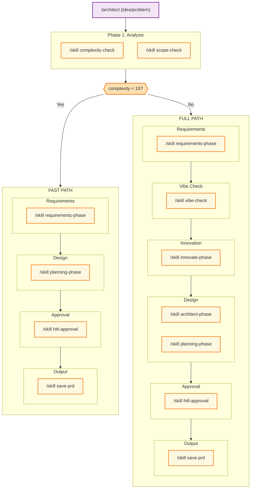
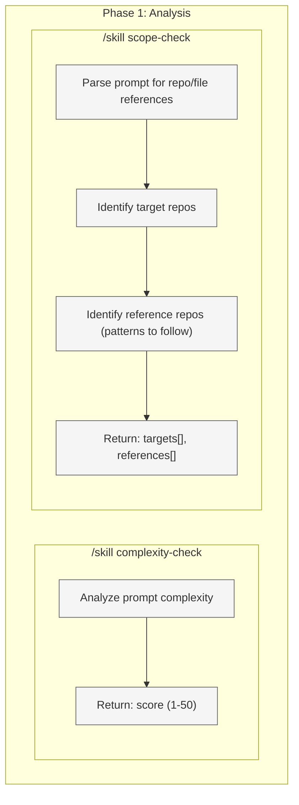
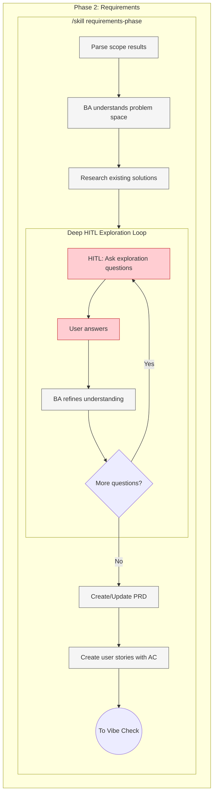
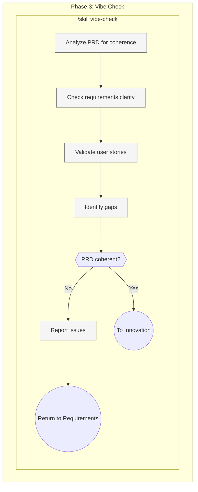
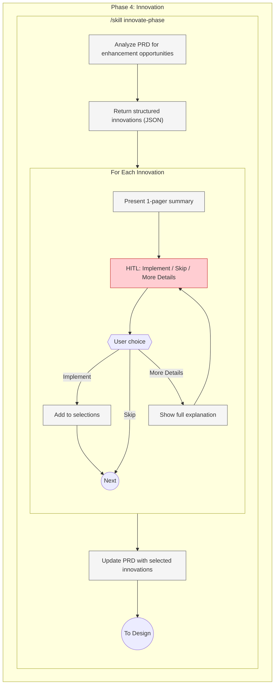
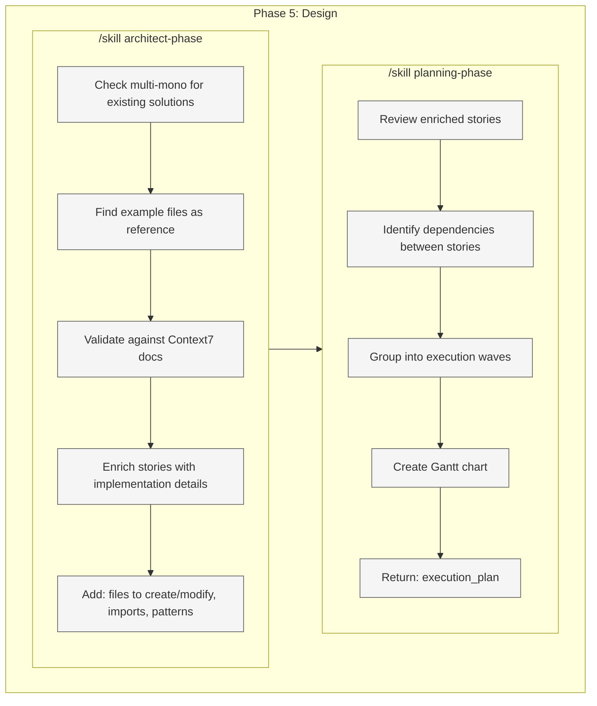
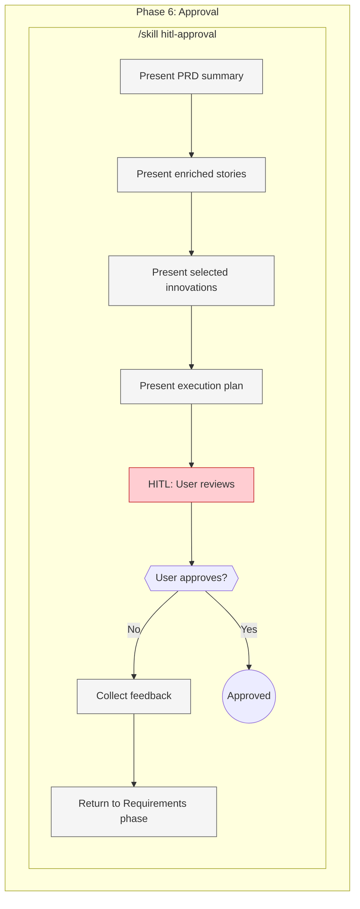
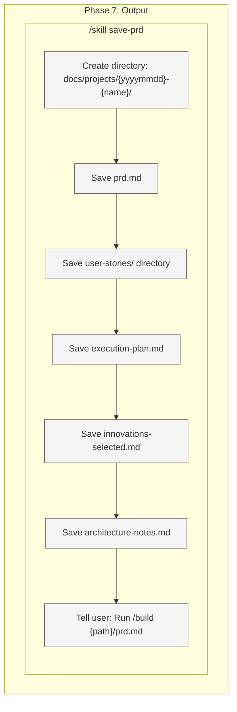

# Architect Command Target State

Target workflow architecture for the `/architect` command - the planning command for when you don't know what to build.

**Purpose:** Explore, plan, innovate - creates comprehensive PRD for /build to execute.

**Use when:** You have a vague idea or problem but don't know exactly what to build.

**Output:** PRD file ready for `/build {prd-path}` to execute.

---

## 1. High-Level Workflow (Skills Only)



**Legend:**

| Color  | Meaning           |
| ------ | ----------------- |
| Purple | Entry point       |
| Blue   | Phase container   |
| Yellow | Skill (reusable)  |
| Orange | Complexity router |

**Fast Path (<15):** Skip Vibe Check, Innovation, architect-phase. Quick requirements → planning → approve → save.

**Full Path (≥15):** Deep exploration with vibe check, innovation advisor, full architecture.

---

## 2. Phase 1: Analysis (Exploded)

**Execution:** PARALLEL - spawn both skills in single message



**Output:**

- `complexity` - Score 1-50 (drives model selection)
- `targets[]` - Repos/paths to modify
- `references[]` - Repos/paths to use as patterns

---

## 3. Phase 2: Requirements (Exploded)

**Execution:** Sequential with deep HITL exploration loop



**Key:** Deep exploration - BA asks many questions to understand vague requirements.

**Output:** Draft PRD + user stories (not yet validated)

---

## 4. Phase 3: Vibe Check (Exploded)

**Execution:** Single MCP tool call



**Key:** Quality gate before innovation phase.

**On failure:** Return to Requirements phase for revision.

---

## 5. Phase 4: Innovation (Exploded)

**Execution:** Sequential with HITL selection per innovation



**Key:** ALWAYS runs for /architect (unlike /build where it's skipped).

**Output:** PRD updated with user-selected innovations

---

## 6. Phase 5: Design (Exploded)

**Execution:** Sequential - architect first, then planning



**Output:** Enriched stories + execution plan with waves

---

## 7. Phase 6: Approval (Exploded)

**Execution:** HITL approval loop



**Key:** User reviews complete PRD + plan before finalizing.

**Output:** Approved PRD + execution plan

---

## 8. Phase 7: Output (Exploded)

**Execution:** Sequential



**Output:** PRD file structure ready for `/build {prd-path}` to execute

**NO EXECUTION** - /architect is planning only.

---

## 9. Quick Reference

| Phase | Skill                       | Agent              | Model  |
| ----- | --------------------------- | ------------------ | ------ |
| 1     | `/skill scope-check`        | scope-check-agent  | sonnet |
| 2     | `/skill requirements-phase` | business-analyst   | opus   |
| 3     | `/skill vibe-check`         | (MCP tool)         | -      |
| 4     | `/skill innovate-phase`     | innovation-advisor | opus   |
| 5     | `/skill architect-phase`    | architect          | sonnet |
| 5     | `/skill planning-phase`     | project-manager    | sonnet |
| 6     | `/skill hitl-approval`      | - (HITL)           | -      |
| 7     | `/skill save-prd`           | -                  | -      |

**Note:** /architect uses opus for BA exploration and innovation because user doesn't know what they want.

---

## 10. Examples

```bash
# Vague problem
/architect "I need to handle user authentication somehow"
→ P1: scope=[current repo]
→ P2: BA explores: OAuth? JWT? Session? What's your user base?
→ P2: Many questions, draft PRD
→ P3: Vibe check passes
→ P4: Innovate: "Consider passwordless auth, SSO, MFA..."
→ P4: User selects innovations
→ P5: Architect validates, PM plans
→ P6: User approves
→ P7: PRD saved
→ "Run /build docs/projects/20251217-user-auth/prd.md"

# Feature idea
/architect "I want to add a dashboard but not sure what should be on it"
→ P1: scope=[current repo]
→ P2: BA explores: Who uses it? What metrics matter? Real-time?
→ P2: Deep exploration, draft PRD
→ P3: Vibe check passes
→ P4: Innovate: "Consider widgets, customization, export..."
→ P4: User selects
→ P5: Architect validates against existing components
→ P5: PM creates phased plan
→ P6: User approves
→ P7: PRD saved

# Integration problem
/architect "need to integrate with Stripe but not sure best approach"
→ P1: scope=[current repo]
→ P2: BA explores: What payments? Subscriptions? One-time?
→ P2: HITL: Payment flows, webhooks, error handling
→ P3: Vibe check passes
→ P4: Innovate: "Consider checkout sessions, payment intents..."
→ P5: Architect checks Context7 for Stripe patterns
→ P6: User approves
→ P7: PRD saved
```

---

## 11. Enforcement Rules

1. ALWAYS run Analysis phase first (scope only, NO complexity-check)
2. BA must do DEEP exploration - ask many questions
3. ALWAYS run Vibe Check on PRD
4. ALWAYS run Innovate phase (unlike /build which skips it)
5. Architect must check multi-mono before enriching stories
6. Architect must validate against Context7 docs
7. Planning must create execution plan with waves
8. Final approval required before saving PRD
9. **NO EXECUTION** - output is PRD only
10. Tell user to run `/build {prd-path}` to execute

---

## 12. Comparison: /architect vs /build

| Aspect         | /architect               | /build                   |
| -------------- | ------------------------ | ------------------------ |
| **When**       | Don't know what to build | Know what to build       |
| **Input**      | Vague idea/problem       | Clear requirement or PRD |
| **BA**         | Deep exploration         | Clarify details          |
| **Vibe Check** | YES                      | NO                       |
| **Innovate**   | ALWAYS                   | NEVER                    |
| **Model**      | opus for BA              | sonnet for BA            |
| **Output**     | PRD                      | Code                     |
| **Execution**  | NO                       | YES                      |

---

## 13. Output Structure

```
docs/projects/{yyyymmdd}-{name}/
├── prd.md                    # Main PRD document
├── user-stories/
│   ├── US-001-{slug}.md      # Individual stories (enriched)
│   ├── US-002-{slug}.md
│   └── ...
├── execution-plan.md         # PM's Gantt chart
├── innovations-selected.md   # Innovations chosen by user
└── architecture-notes.md     # Architect's validation notes
```
