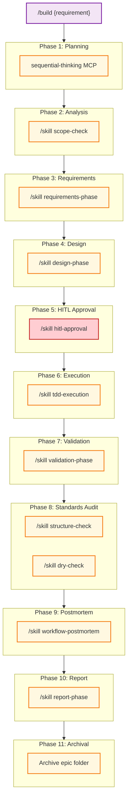
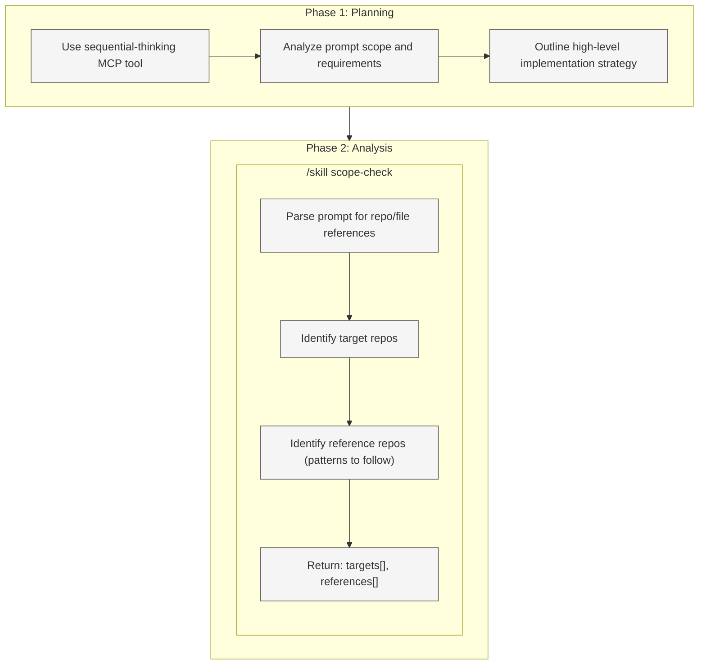
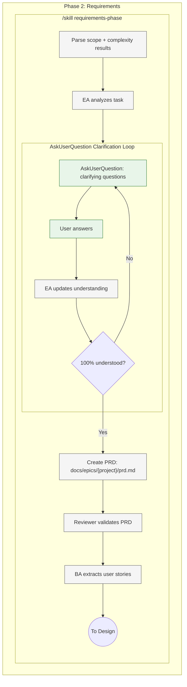
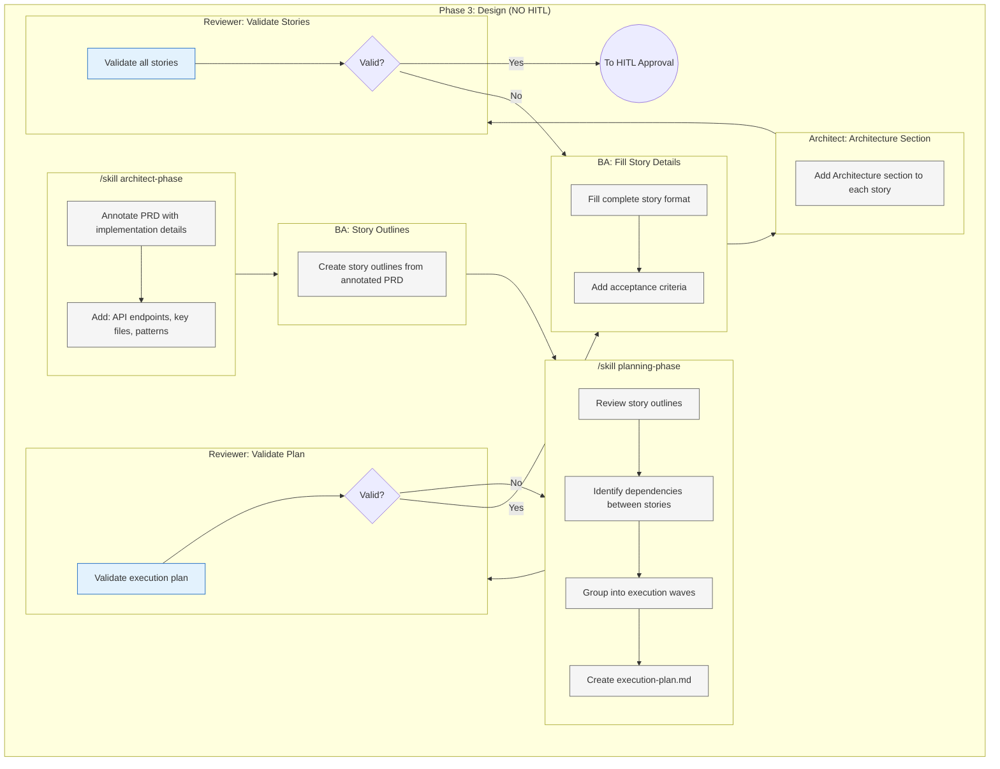
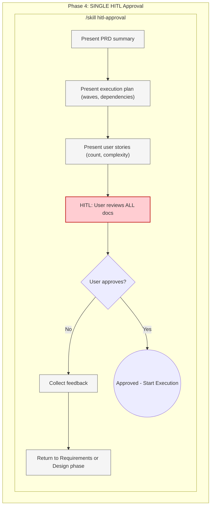
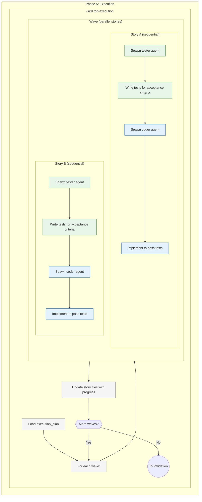
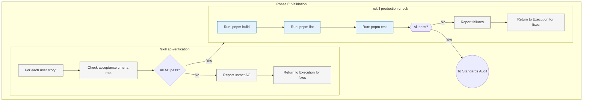
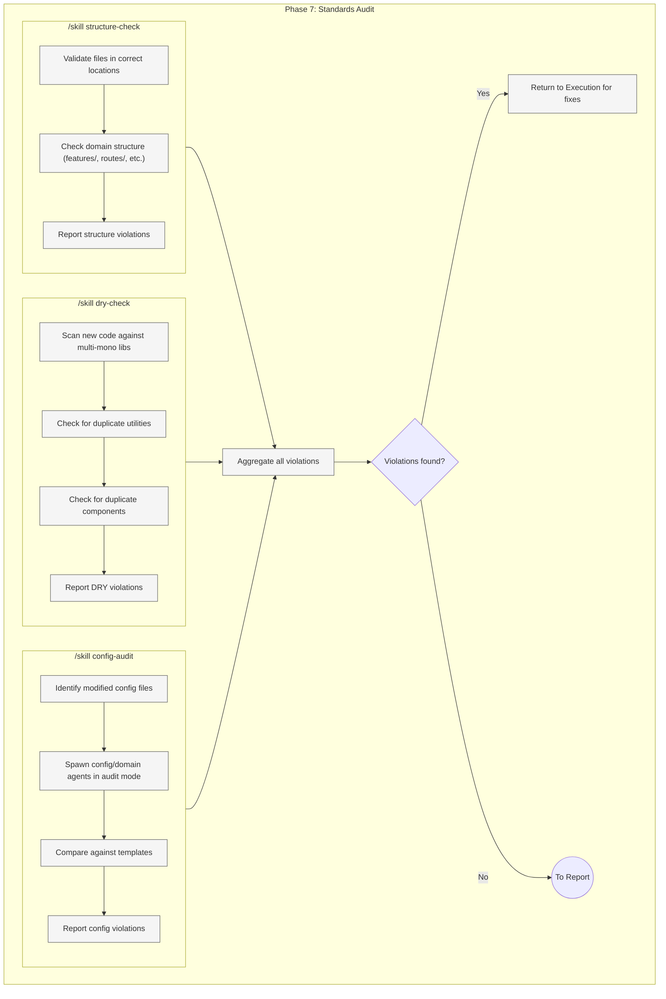
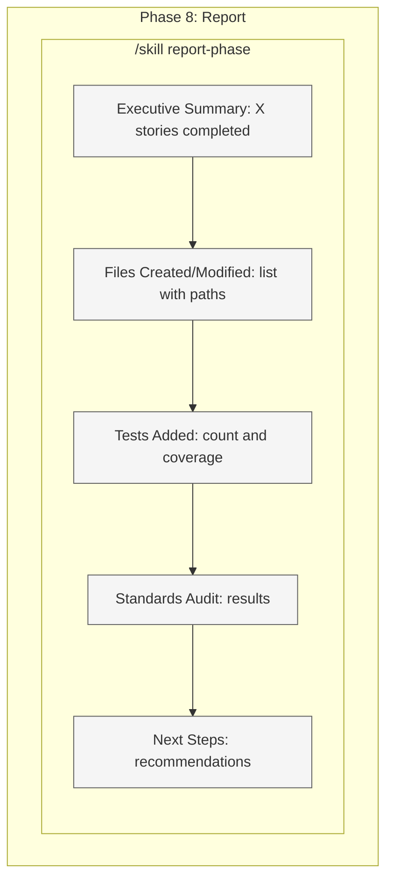

# Build Command Target State

Target workflow architecture for the `/build` command - building features when you know what you want.

**Purpose:** Execute known requirements through TDD workflow with standards compliance.

**Use when:** You know what you want to build. For exploration/planning, use `/architect` instead.

---

## 1. High-Level Workflow (Skills Only)



**Legend:**

| Color  | Meaning            |
| ------ | ------------------ |
| Purple | Entry point        |
| Blue   | Phase container    |
| Yellow | Skill (reusable)   |
| Red    | HITL approval gate |

**/build is ALWAYS full workflow.** No complexity routing - use `/ms` for simple tasks.

---

## 2. Phase 1: Planning + Phase 2: Analysis (Exploded)

**Execution:** Sequential - planning first, then scope analysis



**Output:**

- `targets[]` - Repos/paths to modify
- `references[]` - Repos/paths to use as patterns

---

## 3. Phase 2: Requirements (Exploded)

**Execution:** Sequential with AskUserQuestion clarification loop (NOT HITL)



**Key:** EA uses AskUserQuestion until 100% understanding, then creates PRD. NO HITL in this phase.

**Output:** PRD + user stories (continues to Design, NOT approval)

---

## 4. Phase 3: Design (Exploded)

**Execution:** Sequential - architect, BA, PM, reviewer (NO HITL)



**Output:** Enriched stories + execution plan with waves (continues to SINGLE HITL)

---

## 5. Phase 4: Approval (Exploded)

**Execution:** SINGLE HITL approval for all documentation



**Key:** This is the ONLY HITL gate. User reviews PRD + execution plan + stories before any code is written.

**Output:** All docs approved → proceed to execution

---

## 6. Phase 5: Execution (Exploded)

**Execution:** TDD pairs - sequential within story, parallel across stories



**Key:** Per story: tester writes tests first, then coder implements. Multiple stories run in parallel.

**Output:** Code + tests for all stories

---

## 7. Phase 6: Validation (Exploded)

**Execution:** Sequential - AC verification then production check



**Output:** All AC verified, build/lint/test passing

---

## 8. Phase 7: Standards Audit (Exploded)

**Execution:** Parallel checks, then fix loop if needed



**Key:** Ensures new code follows MetaSaver standards before completion.

**Output:** All standards pass (or fixes applied)

---

## 9. Phase 8: Report (Exploded)

**Execution:** Sequential



**Output:** Complete build report in markdown

---

## 10. Quick Reference

| Phase | Skill                       | Agent                  |
| ----- | --------------------------- | ---------------------- |
| 1     | `/skill scope-check`        | scope-check-agent      |
| 2     | `/skill requirements-phase` | business-analyst       |
| 3     | `/skill architect-phase`    | architect              |
| 3     | `/skill planning-phase`     | project-manager        |
| 4     | `/skill hitl-approval`      | - (HITL)               |
| 5     | `/skill tdd-execution`      | tester + coder         |
| 6     | `/skill ac-verification`    | reviewer               |
| 6     | `/skill production-check`   | - (bash)               |
| 7     | `/skill structure-check`    | code-quality-validator |
| 7     | `/skill dry-check`          | code-quality-validator |
| 7     | `/skill config-audit`       | config/domain agents   |
| 8     | `/skill report-phase`       | business-analyst       |

---

## 11. Examples

```bash
# Feature build
/build "Add user profile page to metasaver-com"
→ P1: scope=[metasaver-com], complexity=25
→ P2: BA creates PRD + stories
→ P3: Architect enriches, PM plans 2 waves
→ P4: User approves
→ P5: TDD execution (wave 1, wave 2)
→ P6: All AC pass, build/lint/test pass
→ P7: Structure OK, DRY OK, configs OK
→ P8: Report

# API endpoint
/build "Add GET /api/applications endpoint, follow rugby-crm patterns"
→ P1: scope=[metasaver-com], references=[rugby-crm]
→ P2-P8: Full workflow

# Component build
/build "Create ZApplicationCard component using ZCard from core-components"
→ P1: scope=[metasaver-com]
→ P2: BA creates PRD for component
→ P3: Architect notes ZCard dependency
→ P4-P8: Full workflow
```

---

## 12. Enforcement Rules

1. **NO tool-check** - Removed from analysis
2. **NO vibe-check** - Only /architect has this
3. **NO innovation phase** - Only /architect has this
4. **ALWAYS create PRD** - Even for simple builds
5. **TDD execution** - Tests first, then implementation
6. **Sequential within story** - Tester → Coder
7. **Parallel across stories** - Multiple pairs per wave
8. **Standards audit AFTER build passes** - structure + DRY + configs
9. **Always produce report**

---

## 13. Comparison: /build vs /audit vs /architect

| Aspect              | /build               | /audit                      | /architect           |
| ------------------- | -------------------- | --------------------------- | -------------------- |
| **Purpose**         | Build features       | Validate compliance         | Explore & plan       |
| **Analysis**        | scope                | scope + agent               | scope                |
| **PRD**             | Always               | Always                      | Always               |
| **Vibe Check**      | NO                   | NO                          | YES                  |
| **Innovation**      | NO                   | NO                          | YES (always)         |
| **Design**          | architect + planning | planning only               | architect + planning |
| **Execution**       | TDD pairs            | Investigation → Remediation | NO (PRD only)        |
| **Standards Audit** | YES                  | NO                          | NO                   |
| **Output**          | Code + tests         | Fixes + report              | PRD for /build       |

---

## 14. Reusable Skills Summary

Skills shared with other commands:

| Skill                       | /build | /audit | /architect | /debug | /qq |
| --------------------------- | ------ | ------ | ---------- | ------ | --- |
| `/skill scope-check`        | ✅     | ✅     | ✅         | ✅     | ✅  |
| `/skill agent-check`        | -      | ✅     | -          | ✅     | ✅  |
| `/skill requirements-phase` | ✅     | ✅     | ✅         | ✅     | -   |
| `/skill planning-phase`     | ✅     | ✅     | ✅         | -      | -   |
| `/skill architect-phase`    | ✅     | -      | ✅         | -      | -   |
| `/skill hitl-approval`      | ✅     | ✅     | ✅         | ✅     | -   |
| `/skill ac-verification`    | ✅     | ✅     | -          | -      | -   |
| `/skill production-check`   | ✅     | ✅     | -          | -      | -   |
| `/skill report-phase`       | ✅     | ✅     | -          | ✅     | -   |
