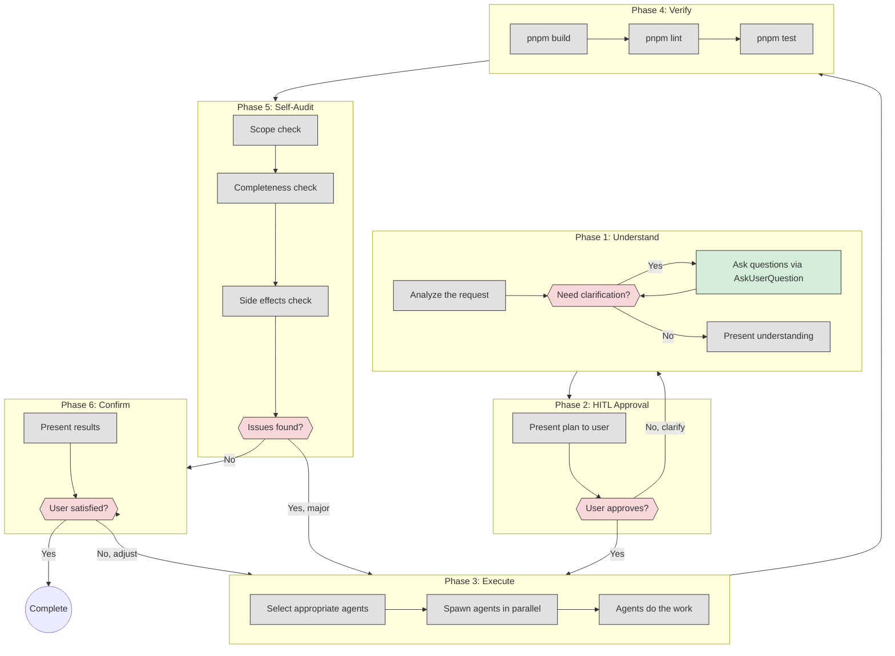
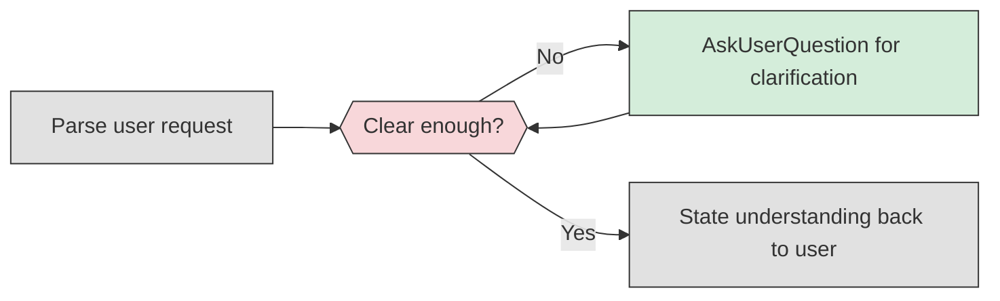
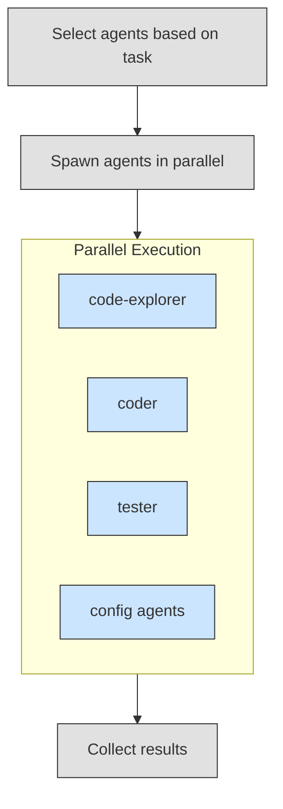

# MS Command Target State

Target workflow architecture for the `/ms` (MetaSaver) command - a simple mini-workflow for quick fixes and small tasks.

**Purpose:** Quick fixes and small tasks without PRD overhead. Uses MetaSaver agents, requires HITL approval before execution, verifies work after.

**Use /ms for:** Quick fixes, small features, mini tasks that don't need formal requirements docs.

**Use /build for:** Large features, multi-epic work, anything needing PRDs and execution plans.

---

## 1. High-Level Flow Overview



---

## 2. Phase Details

### Phase 1: Understand

**Goal:** Make sure we understand what the user wants before doing anything.



**Key behaviors:**

- Analyze the request to understand scope
- If anything is unclear, ask using AskUserQuestion tool
- Present back: "Here's what I understand you want: ..."
- List specific changes/files that will be affected

---

### Phase 2: HITL Approval

**Goal:** Get user sign-off before executing anything.

Present to user:

1. What we understood from the request
2. What changes we plan to make
3. Which agents will be used

Ask: "Does this look correct? Proceed?"

**Options:**

- "Yes, proceed" → Go to Phase 3
- "No, let me clarify" → Go back to Phase 1

---

### Phase 3: Execute

**Goal:** Do the work using MetaSaver agents in parallel.



**Agent selection:**

| Task Type               | Agent                                           |
| ----------------------- | ----------------------------------------------- |
| Explore/understand code | `core-claude-plugin:generic:code-explorer`      |
| Write/modify code       | `core-claude-plugin:generic:coder`              |
| Write tests             | `core-claude-plugin:generic:tester`             |
| Review code             | `core-claude-plugin:generic:reviewer`           |
| Config files            | `core-claude-plugin:config:*` (appropriate one) |

**Rules:**

- ALWAYS use MetaSaver agents, never raw tools
- NEVER specify model parameter on Task calls
- Spawn independent tasks in parallel (single message, multiple Task calls)

---

### Phase 4: Verify

**Goal:** Make sure the changes don't break anything.

Run in sequence:

1. `pnpm build` - Compilation check
2. `pnpm lint` - Code quality check
3. `pnpm test` - Test suite check

Report any failures to user.

---

### Phase 5: Self-Audit

**Goal:** Audit your own work before presenting to user.

Before confirming with user, check:

1. **Scope check:** Did we do ONLY what was requested? List any extras added
2. **Completeness check:** Is all requested work done? List anything missing
3. **Side effects:** Did we modify files not related to the request?
4. **Quality check:** Does the implementation follow the approach we got approval for?

**If issues found:**

- Minor issues: Note them for user in Confirm phase
- Major issues: Return to Phase 3 (Execute) to fix before confirming

**This catches:**

- Feature creep (adding things not requested)
- Incomplete work (forgetting parts of the request)
- Scope drift (changing unrelated files)

---

### Phase 6: Confirm

**Goal:** Verify we solved what the user asked for.

Present:

1. What was changed
2. Files modified/created
3. Build/lint/test status

Ask: "Did this solve what you asked for?"

**Options:**

- "Yes, done" → Complete
- "No, need adjustments" → Back to Phase 3 with clarification

---

## 3. What /ms Does NOT Do

| Feature             | /ms | /build |
| ------------------- | --- | ------ |
| PRD files           | No  | Yes    |
| Execution plans     | No  | Yes    |
| User story files    | No  | Yes    |
| workflow-state.json | No  | Yes    |
| Multiple waves      | No  | Yes    |
| Complex routing     | No  | Yes    |
| Formal requirements | No  | Yes    |

---

## 4. Examples

```bash
# Quick fix
/ms "fix the typo in the login button"
→ Phase 1: Understand (clear request)
→ Phase 2: "I'll fix the typo in the login button. Proceed?"
→ Phase 3: Spawn coder agent
→ Phase 4: Build/lint/test pass
→ Phase 5: Self-Audit (scope ok, complete, no extras)
→ Phase 6: "Fixed. Did this solve it?"

# Small feature
/ms "add a loading spinner to the submit button"
→ Phase 1: Understand, clarify which button
→ Phase 2: "I'll add a spinner to the form submit button. Proceed?"
→ Phase 3: Spawn coder + tester agents in parallel
→ Phase 4: Build/lint/test pass
→ Phase 5: Self-Audit (scope ok, tests added as approved)
→ Phase 6: "Added spinner with tests. Did this solve it?"

# Exploration + fix
/ms "find where the auth token is stored and add expiry check"
→ Phase 1: Understand (clear enough)
→ Phase 2: "I'll explore auth code, then add expiry check. Proceed?"
→ Phase 3: Spawn code-explorer, then coder based on findings
→ Phase 4: Build/lint/test pass
→ Phase 5: Self-Audit (only auth.ts modified, matches request)
→ Phase 6: "Added expiry check in auth.ts. Did this solve it?"
```

---

## 5. Enforcement

1. ALWAYS use AskUserQuestion tool for questions (never inline questions in response)
2. ALWAYS get HITL approval before executing (Phase 2)
3. ALWAYS use MetaSaver agents from `core-claude-plugin:*`
4. ALWAYS spawn independent agents in parallel (single message, multiple Task calls)
5. ALWAYS verify with build/lint/test after execution (Phase 4)
6. ALWAYS run Self-Audit before confirming (Phase 5) - catch feature creep and incomplete work
7. ALWAYS confirm with user after completion (Phase 6)
8. NEVER use raw tools (Read, Write, Bash) when an agent exists for the task
9. NEVER specify model parameter on Task calls
10. NEVER skip HITL approval phase
11. NEVER assume - ask if unclear

---

## 6. When to Use /build Instead

Use `/build` when:

- Feature is large (multiple epics)
- Formal requirements documentation needed
- Multiple developers/stakeholders involved
- Work spans multiple sessions
- Need execution plan with waves
- Complex dependencies between tasks

Use `/ms` when:

- Quick fix
- Small feature (single session)
- No formal docs needed
- Clear, simple scope
