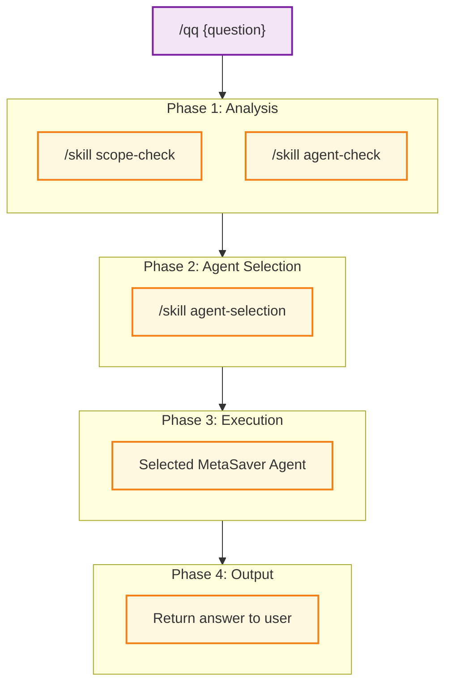
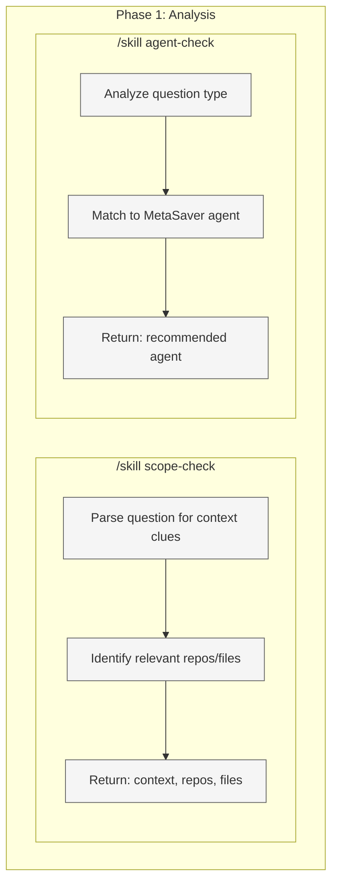
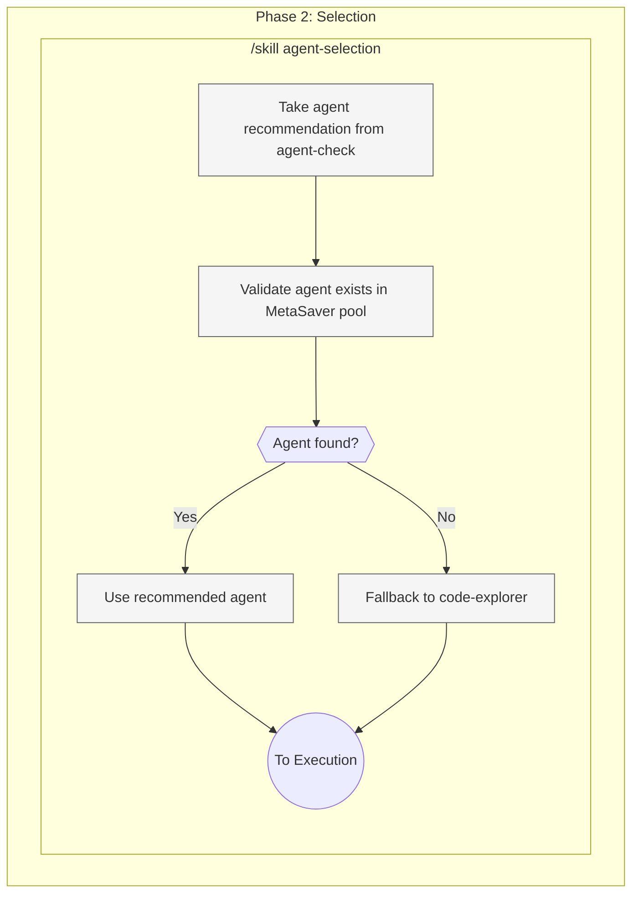
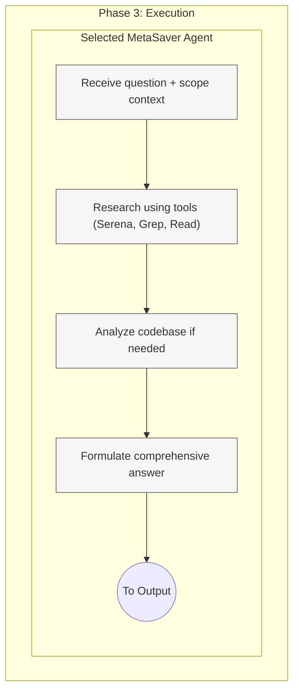
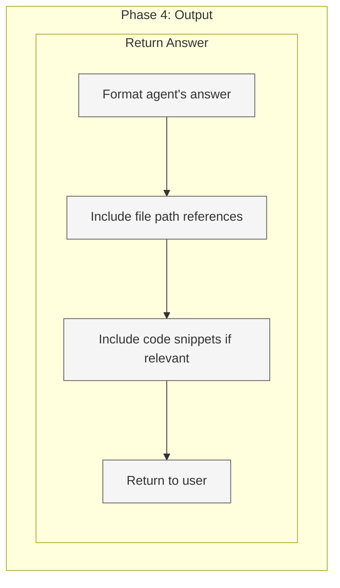

# QQ Command Target State

Target workflow architecture for the `/qq` command - quick questions answered by MetaSaver agents.

**Purpose:** Answer questions using the most appropriate MetaSaver agent without full workflow overhead.

**Use when:** You have a question that needs agent expertise but doesn't require building anything.

---

## 1. High-Level Workflow (Skills Only)



**Legend:**

| Color  | Meaning          |
| ------ | ---------------- |
| Purple | Entry point      |
| Blue   | Phase container  |
| Yellow | Skill (reusable) |

**/qq always uses agent selection.** No complexity routing.

---

## 2. Phase 1: Analysis (Exploded)

**Execution:** PARALLEL - spawn both skills in single message



**Output:**

- `complexity` - Score 1-50 (drives model selection)
- `scope`: Context for the question (repos, files, domains)
- `agent`: Best MetaSaver agent to answer

---

## 3. Phase 2: Selection (Exploded)

**Execution:** Sequential



**Agent Pool:**

| Category | Agents                                                         |
| -------- | -------------------------------------------------------------- |
| Generic  | code-explorer, architect, coder, tester, reviewer, backend-dev |
| Domain   | backend agents, frontend agents, database agents               |
| Config   | eslint-agent, vite-agent, etc.                                 |

**Selection Priority:**

1. Exact match from agent-check recommendation
2. Domain-specific agent if question is domain-focused
3. `code-explorer` as fallback for general questions

---

## 4. Phase 3: Execution (Exploded)

**Execution:** Single agent spawn



**Key:** Agent is in "answer mode" not "build mode" - NO code changes.

**Agent receives:**

1. **Original question** from user
2. **Scope context** from scope-check
3. **Instructions** to answer question (not build anything)

---

## 5. Phase 4: Output (Exploded)

**Execution:** Return answer



**Output includes:**

- Direct answer to the question
- Supporting evidence (file paths, code snippets)
- References for further reading if applicable

**NO:**

- PRD creation
- Execution planning
- Code changes
- Approval gates

---

## 4. Quick Reference

| Phase | Function    | Skill/Tool           | Agent                    |
| ----- | ----------- | -------------------- | ------------------------ |
| 1     | Scope Check | `/skill scope-check` | scope-check-agent        |
| 1     | Agent Check | `/skill agent-check` | agent-check-agent        |
| 2     | Selection   | -                    | (logic)                  |
| 3     | Execution   | Agent tools          | Selected MetaSaver agent |
| 4     | Output      | -                    | -                        |

---

## 5. Examples

```bash
# Architecture question
/qq "How does the authentication flow work in this app?"
→ Scope: Current repo
→ Agent: code-explorer
→ Answer: [Detailed explanation of auth flow with file references]

# Pattern question
/qq "What validation patterns do we use for forms?"
→ Scope: Current repo + references to shared libs
→ Agent: coder
→ Answer: [Form validation patterns with code examples]

# Config question
/qq "Why is ESLint configured this way?"
→ Scope: Current repo
→ Agent: eslint-agent
→ Answer: [Explanation of ESLint config choices]

# Cross-repo question
/qq "How does rugby-crm handle user roles compared to here?"
→ Scope: Current repo + rugby-crm reference
→ Agent: code-explorer
→ Answer: [Comparison of role handling between repos]

# Backend question
/qq "What's the database schema for users?"
→ Scope: Current repo database package
→ Agent: prisma-database-agent
→ Answer: [Schema explanation with model details]

# Testing question
/qq "What's our testing strategy for API endpoints?"
→ Scope: Current repo tests
→ Agent: tester
→ Answer: [Testing patterns and coverage details]
```

---

## 7. Enforcement Rules

1. ALWAYS run Analysis phase first (scope + agent check)
2. ALWAYS validate agent exists before spawning
3. Use `code-explorer` as fallback if agent not found
4. Agent executes in "answer mode" - NO code changes
5. NO PRD creation - this is quick questions only
6. NO approval gates - direct answer
7. NO execution planning - just answer
8. Include file references in answers when relevant
9. Keep answers focused and concise
10. Respect scope boundaries from scope-check

---

## 8. Agent Mapping Examples

| Question Pattern                  | Recommended Agent     |
| --------------------------------- | --------------------- |
| "How does X work?"                | code-explorer         |
| "What's the pattern for Y?"       | coder                 |
| "Why is config Z this way?"       | relevant config agent |
| "What tests cover X?"             | tester                |
| "Is this code secure?"            | security-engineer     |
| "How is the database structured?" | prisma-database-agent |
| "What's the API for X?"           | backend-dev           |
| "How is component Y built?"       | react-app-agent       |

---

## 9. Comparison: /qq vs /ms vs /build

| Aspect        | /qq              | /ms                  | /build             |
| ------------- | ---------------- | -------------------- | ------------------ |
| **Purpose**   | Answer questions | Route to workflow    | Execute known task |
| **Input**     | Question         | Any prompt           | Requirement or PRD |
| **Output**    | Answer           | Varies by complexity | Code               |
| **PRD**       | NO               | Maybe (≥15)          | Yes (≥15)          |
| **Execution** | NO               | Yes                  | Yes                |
| **Approval**  | NO               | Yes (≥15)            | Yes (≥15)          |

---

## 10. When NOT to Use /qq

Use a different command when:

| Situation                | Use Instead  |
| ------------------------ | ------------ |
| Need to build something  | `/build`     |
| Don't know what to build | `/architect` |
| Need to debug in browser | `/debug`     |
| Need to audit configs    | `/audit`     |
| Complex multi-step task  | `/ms`        |

/qq is for **questions only** - if the answer requires action, use another command.
