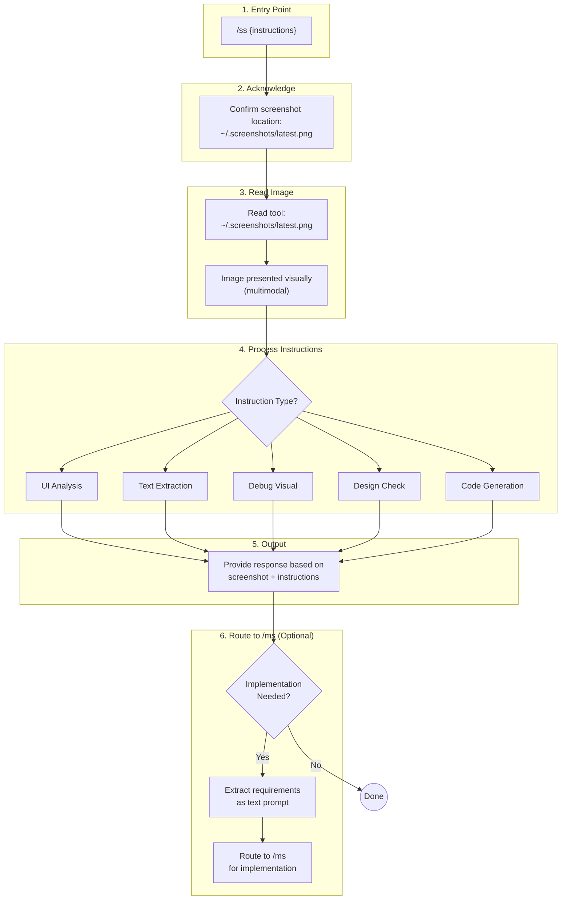
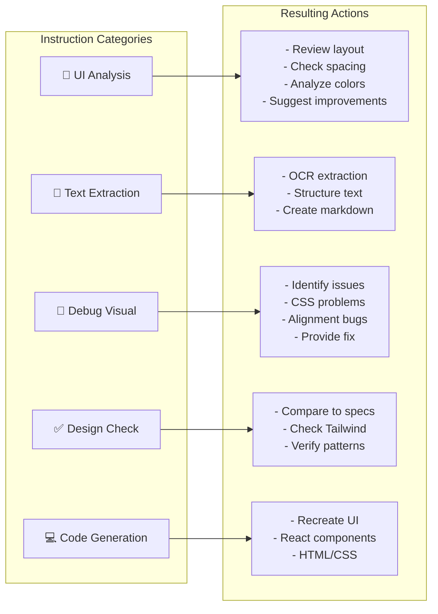
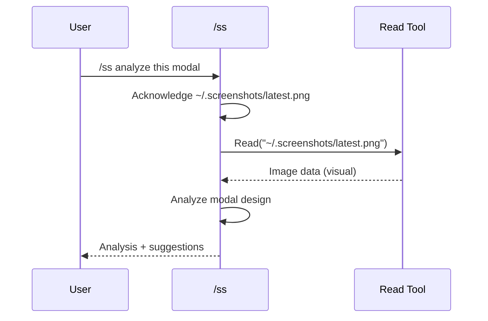
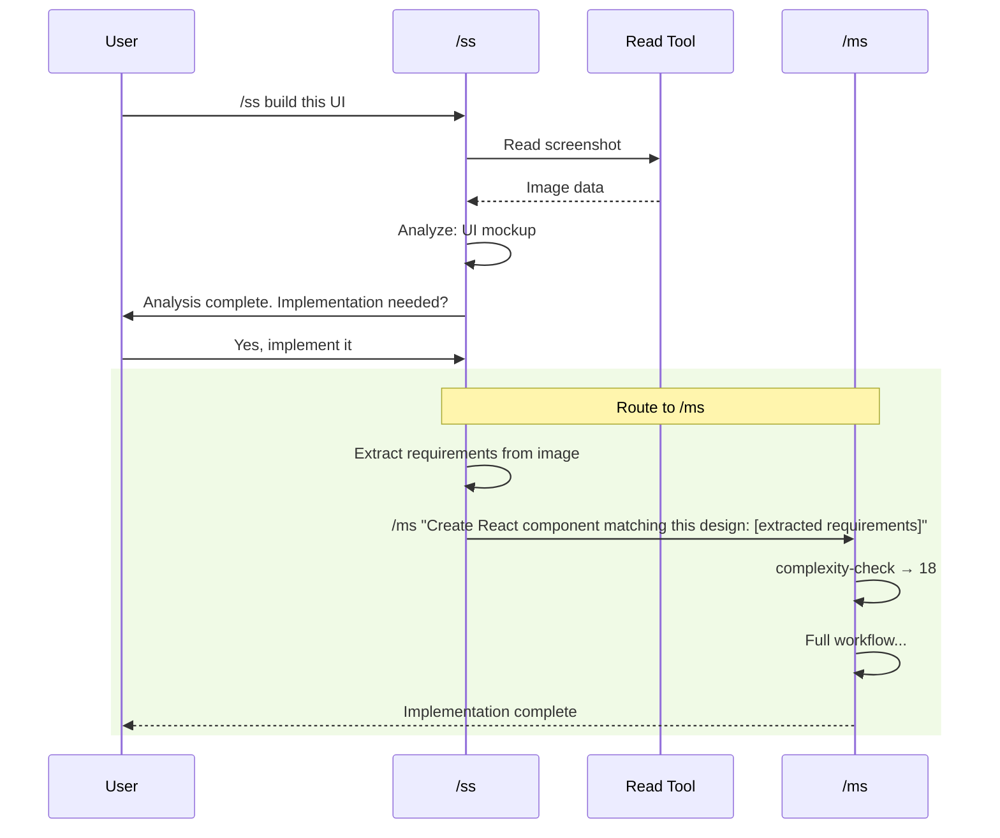

# SS Command Target State

Target workflow architecture for the `/ss` (Screenshot) command.

**Purpose:** Analyze screenshots saved to `~/.screenshots/latest.png`, process user instructions, and optionally route to /ms for implementation.

---

## 1. High-Level Flow Overview



---

## 2. Instruction Types



---

## 3. Simple Sequence



---

## 4. Optional Route to /ms

When analysis suggests implementation is needed, `/ss` can route to `/ms`:



**Decision factors for routing:**

- User explicitly asks to "build", "implement", "create"
- Code generation task requires multiple files
- Design mockup needs full component structure

---

## 5. Quick Reference

| Step | Action               | Tool | Model               |
| ---- | -------------------- | ---- | ------------------- |
| 1    | Entry                | -    | -                   |
| 2    | Acknowledge location | -    | -                   |
| 3    | Read image           | Read | Claude (multimodal) |
| 4    | Process instructions | -    | Claude              |
| 5    | Output response      | -    | Claude              |

---

## 6. Example Workflows

### UI Analysis

```
/ss analyze this dashboard
→ Read image
→ Analyze: layout, spacing, colors, typography
→ Output: 5 specific improvement suggestions
```

### Text Extraction

```
/ss extract all text as markdown
→ Read image
→ OCR all visible text
→ Output: Structured markdown document
```

### Debug Visual

```
/ss why is the modal off-center?
→ Read image
→ Identify CSS issue (missing flex centering)
→ Output: Problem + code fix
```

### Design Check

```
/ss does this follow Tailwind conventions?
→ Read image
→ Check spacing (4px increments), colors, etc.
→ Output: Compliance report
```

### Code Generation

```
/ss recreate this as React component
→ Read image
→ Analyze structure, styles
→ Output: React + Tailwind code
```

---

## 7. Integration Points

| Tool/Feature   | Used                         |
| -------------- | ---------------------------- |
| Read tool      | ✅ For image                 |
| /ms routing    | ✅ Optional (if impl needed) |
| Agents         | ❌ None (unless routed)      |
| MCP Tools      | ❌ None (unless routed)      |
| PRD/Vibe Check | ❌ None (unless routed)      |
| Innovate       | ❌ None                      |

**Simplest command in the system** - direct Claude with multimodal input.
When implementation is needed, routes to /ms which handles full workflow.
