# Audit Command Target State

Target workflow architecture for the `/audit` command using Mermaid diagrams.

**Key differences from /build:**

- No Innovate phase - Audit is for compliance checking, not feature improvement
- Human validation (prd-approval) for complexity ≥15 before Architecture

---

## 1. High-Level Flow Overview

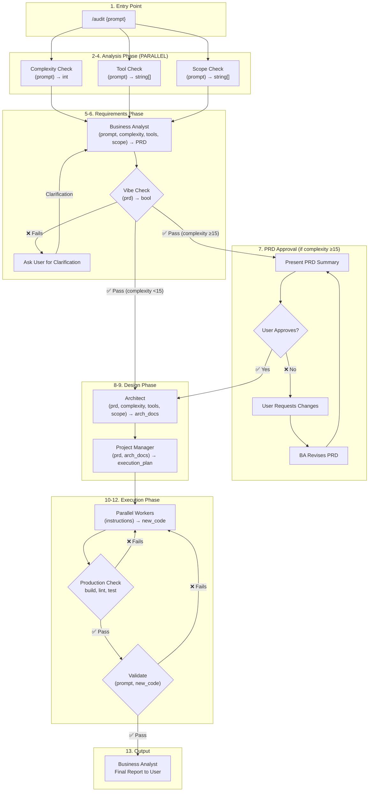

---

## 2. Complete Sequence Diagram

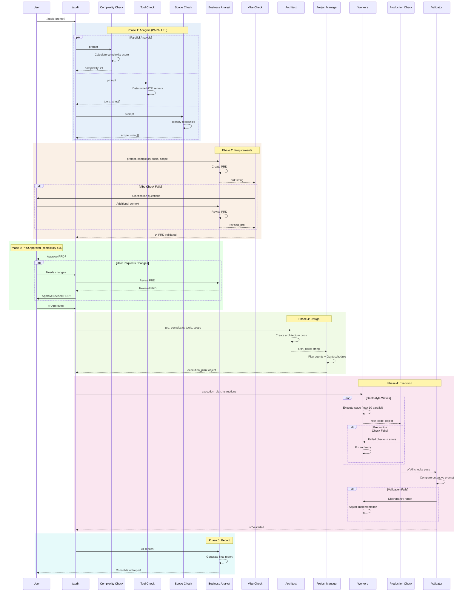

---

## 3. Function Signatures

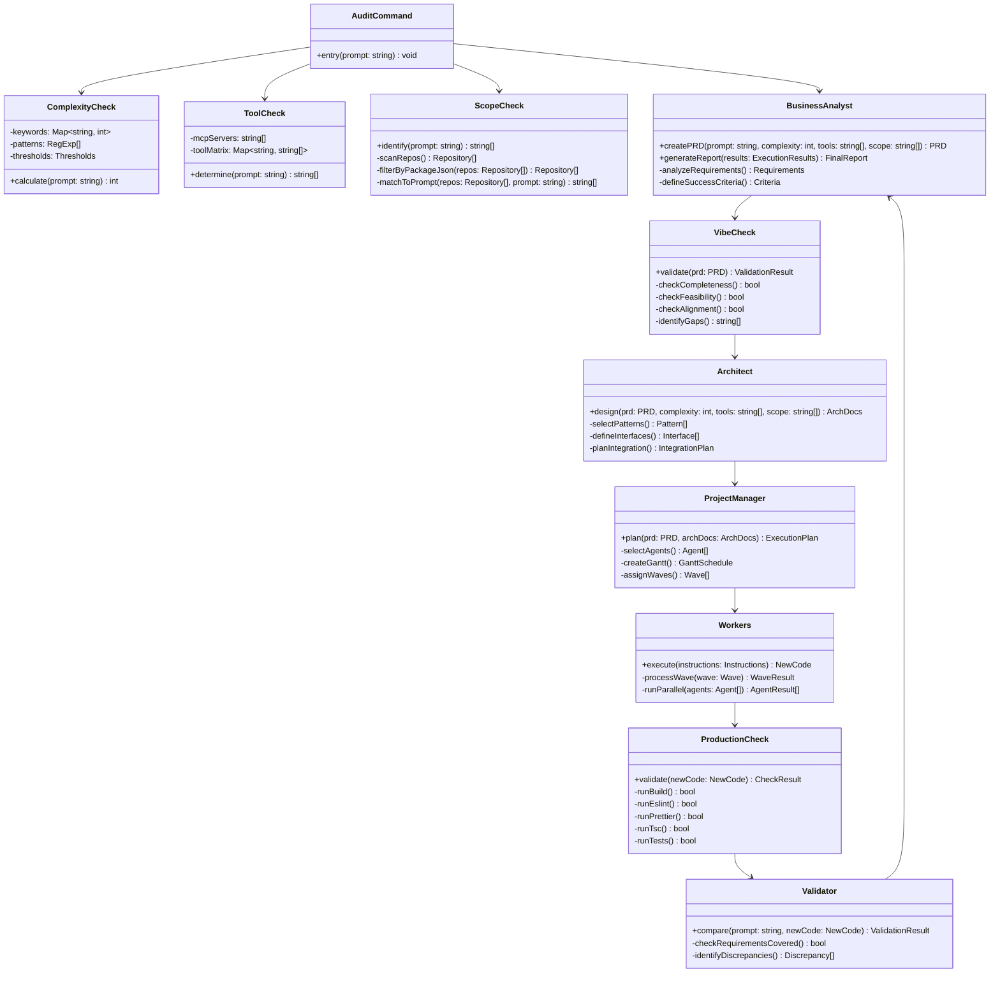

---

## 4. Feedback Loops Detail

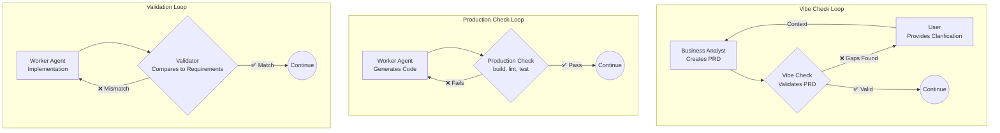

---

## 5. Analysis Phase Detail (Parallel Execution)

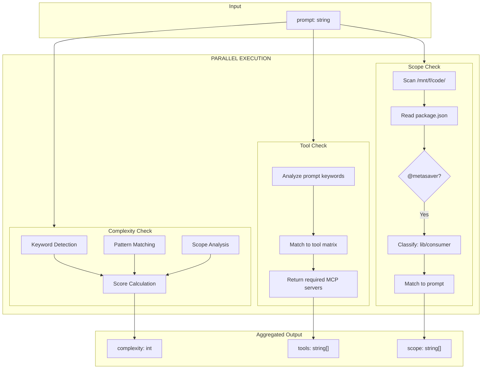

---

## 6. Requirements Phase Detail

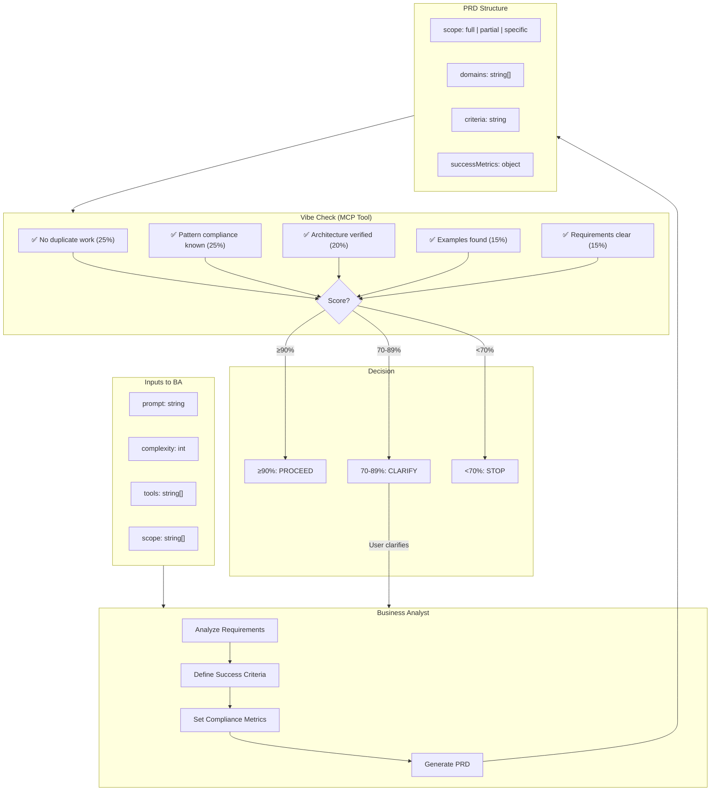

---

## 7. Design Phase Detail

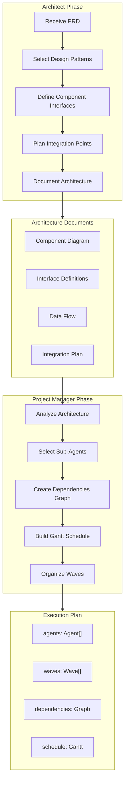

---

## 8. Execution Phase - Gantt-Style Waves

```mermaid
gantt
    title Parallel Worker Execution
    dateFormat X
    axisFormat %s

    section Wave 1
    eslint-agent       :w1a, 0, 3
    prettier-agent     :w1b, 0, 2
    typescript-agent   :w1c, 0, 4
    editorconfig-agent :w1d, 0, 2
    turbo-agent        :w1e, 0, 3
    pnpm-workspace-agent :w1f, 0, 2
    vite-agent         :w1g, 0, 3
    vitest-agent       :w1h, 0, 3
    postcss-agent      :w1i, 0, 2
    tailwind-agent     :w1j, 0, 3

    section Wave 2
    gitignore-agent    :w2a, after w1a, 2
    gitattributes-agent :w2b, after w1a, 2
    husky-agent        :w2c, after w1a, 3
    commitlint-agent   :w2d, after w1a, 2
    github-workflow-agent :w2e, after w1a, 4
    nvmrc-agent        :w2f, after w1a, 1
    readme-agent       :w2g, after w1a, 3
    vscode-agent       :w2h, after w1a, 2
    scripts-agent      :w2i, after w1a, 2
    claude-md-agent    :w2j, after w1a, 2

    section Wave 3
    env-example-agent  :w3a, after w2a, 2
    nodemon-agent      :w3b, after w2a, 2
    npmrc-template-agent :w3c, after w2a, 1
    repomix-config-agent :w3d, after w2a, 2
    root-package-json-agent :w3e, after w2a, 3
    monorepo-structure-agent :w3f, after w2a, 2

    section Quality Gates
    Production Check   :crit, pc, after w3f, 2
    Validation         :crit, val, after pc, 2
```

---

## 9. Production Check Detail

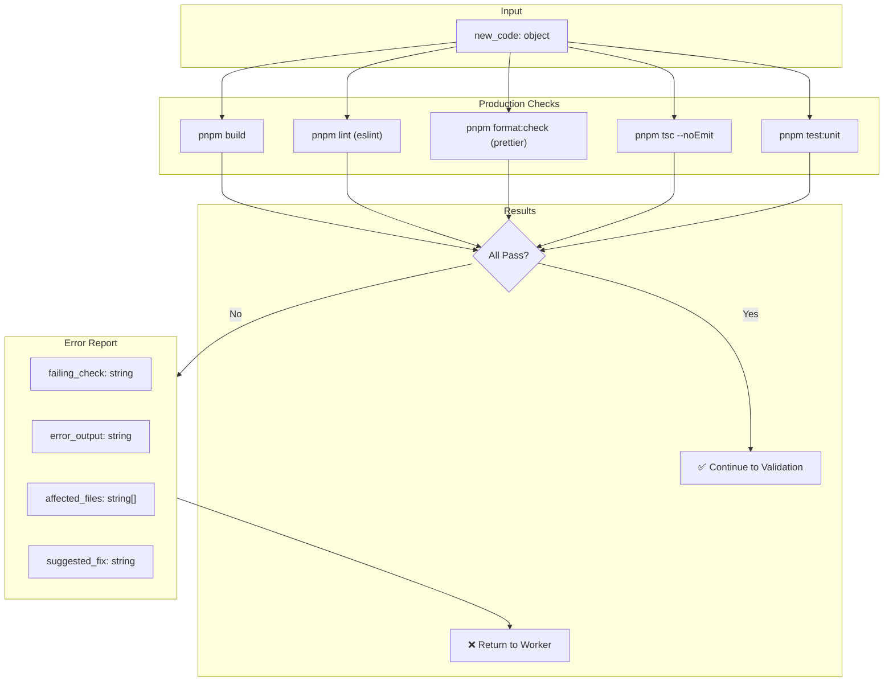

---

## 10. Validation Phase Detail

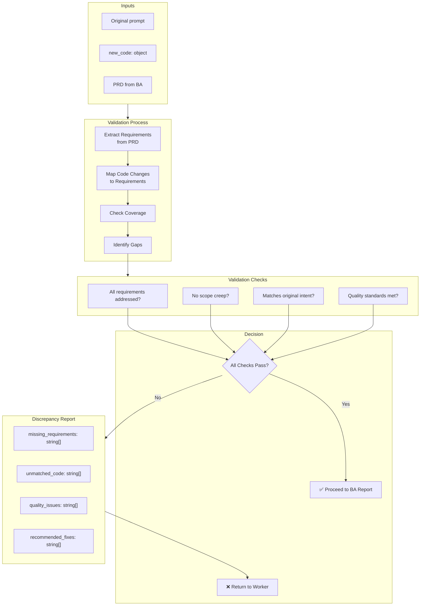

---

## 11. Final Report Flow

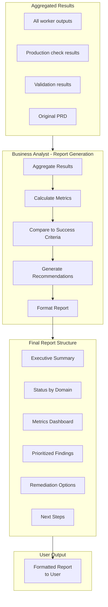

---

## 12. Complete State Machine

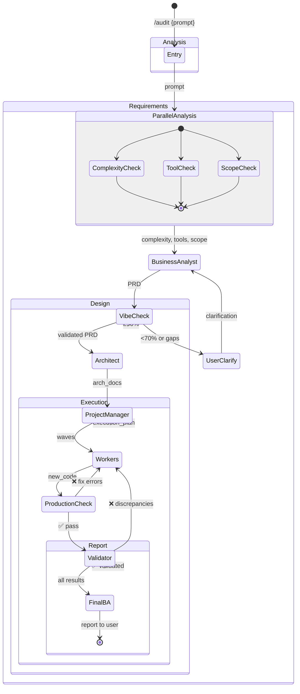

---

## Quick Reference

| Step | Function         | Input                            | Output           | Model       | Parallel | Condition     |
| ---- | ---------------- | -------------------------------- | ---------------- | ----------- | -------- | ------------- |
| 1    | Entry            | prompt                           | -                | -           | -        | -             |
| 2    | Complexity Check | prompt                           | int              | haiku       | ✅ 2-4   | -             |
| 3    | Tool Check       | prompt                           | string[]         | haiku       | ✅ 2-4   | -             |
| 4    | Scope Check      | prompt                           | string[]         | haiku       | ✅ 2-4   | -             |
| 5    | Business Analyst | prompt, complexity, tools, scope | PRD              | sonnet/opus | -        | -             |
| 6    | Vibe Check       | prd                              | bool \| string[] | MCP Tool    | -        | -             |
| 7    | PRD Approval     | prd                              | approval         | Human       | -        | complexity≥15 |
| 8    | Architect        | prd, complexity, tools, scope    | arch_docs        | sonnet      | -        | -             |
| 9    | Project Manager  | prd, arch_docs                   | execution_plan   | sonnet      | -        | -             |
| 10   | Workers          | instructions                     | new_code         | haiku       | ✅ waves | -             |
| 11   | Production Check | new_code                         | bool             | Bash        | -        | -             |
| 12   | Validate         | prompt, new_code                 | bool             | sonnet      | -        | -             |
| 13   | Business Analyst | results                          | report           | sonnet      | -        | -             |

| Feedback Loop       | Trigger               | Target             | Resolution                 |
| ------------------- | --------------------- | ------------------ | -------------------------- |
| Vibe Check → BA     | PRD validation fails  | Business Analyst   | User clarifies, BA revises |
| PRD Approval → BA   | User requests changes | Business Analyst   | BA revises PRD             |
| Production → Worker | Build/lint/test fails | Originating worker | Fix code, re-run checks    |
| Validate → Worker   | Requirements mismatch | Originating worker | Adjust implementation      |
