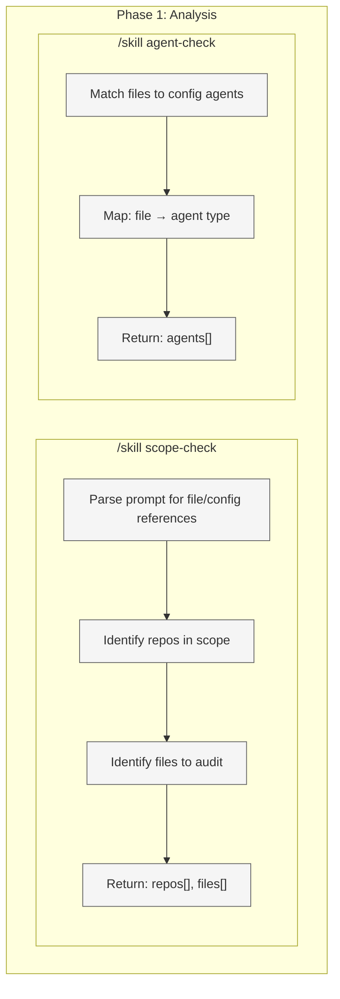
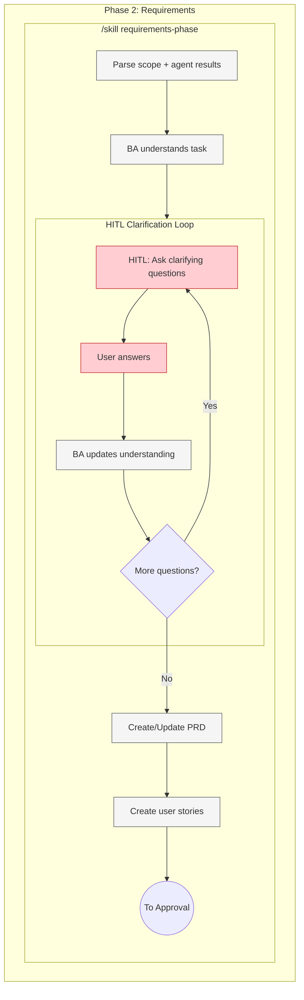
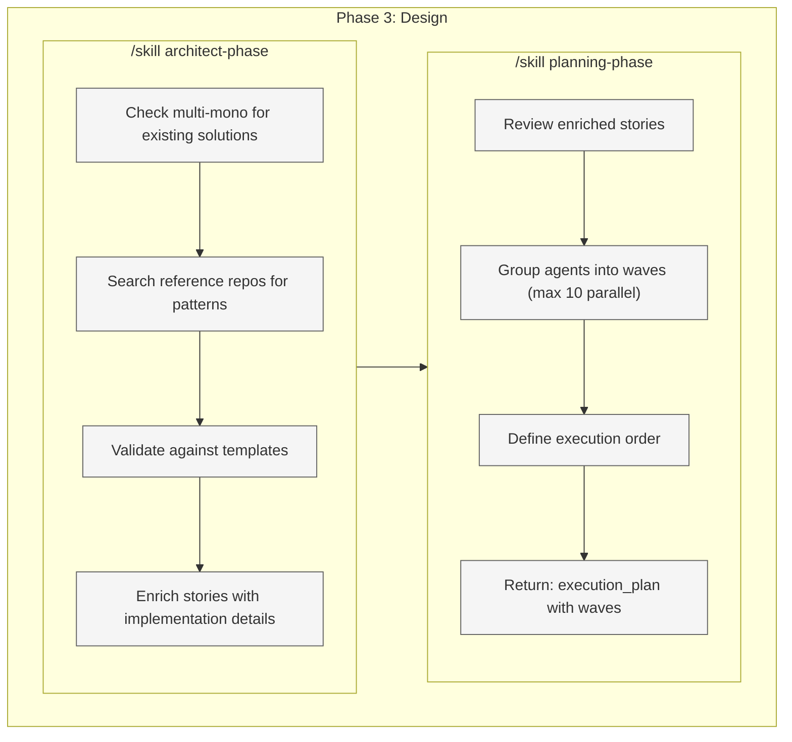
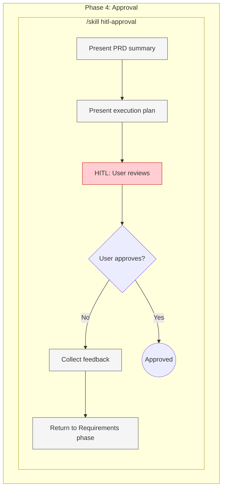
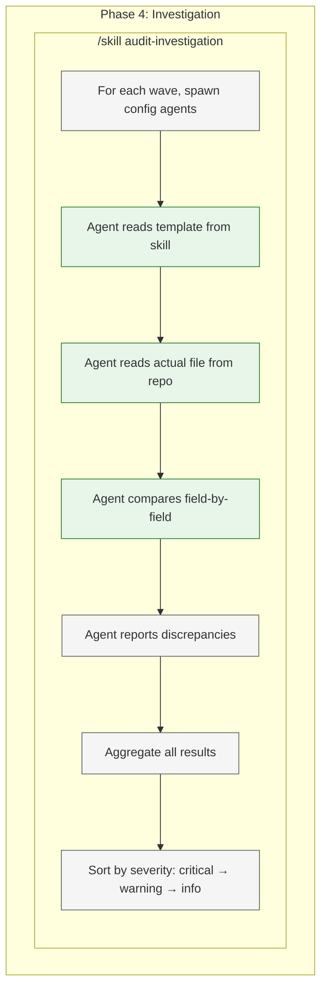
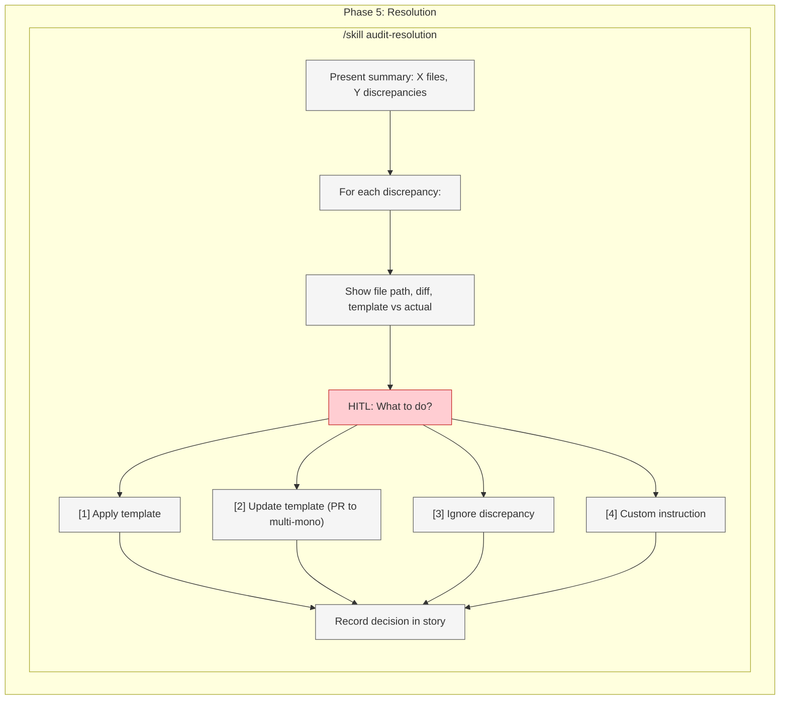
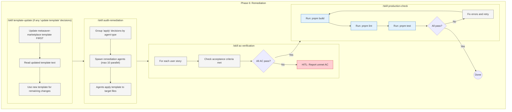
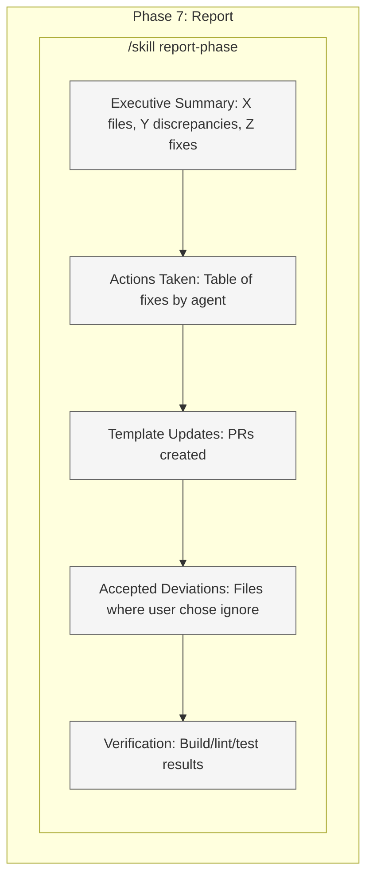

# Audit Command Target State

Target workflow architecture for the `/audit` command - configuration and standards compliance validation.

**Purpose:** Validate configurations against templates with interactive user decisions per discrepancy.

**Use when:** You need to check if configs match standards or audit compliance across repos.

---

## 1. High-Level Workflow (Skills Only)

```mermaid
flowchart LR
    classDef phase fill:#bbdefb,stroke:#1565c0,stroke-width:2px
    classDef skill fill:#fff8e1,stroke:#f57f17,stroke-width:2px
    classDef entry fill:#f3e5f5,stroke:#7b1fa2,stroke-width:2px

    ENTRY["/audit {target}"]:::entry

    subgraph P1["Phase 1: Analysis"]
        direction TB
        SC["/skill scope-check"]:::skill
        AC["/skill agent-check"]:::skill
    end

    subgraph P2["Phase 2: Requirements"]
        direction TB
        REQ["/skill requirements-phase"]:::skill
    end

    subgraph P3["Phase 3: Planning"]
        direction TB
        PLAN["/skill planning-phase"]:::skill
    end

    subgraph P4["Phase 4: Approval"]
        direction TB
        HITL["/skill hitl-approval"]:::skill
    end

    subgraph P5["Phase 5: Investigation"]
        direction TB
        INV["/skill audit-investigation"]:::skill
    end

    subgraph P6["Phase 6: Resolution"]
        direction TB
        RES["/skill audit-resolution"]:::skill
    end

    subgraph P7["Phase 7: Remediation"]
        direction TB
        TPL["/skill template-update"]:::skill
        REM["/skill audit-remediation"]:::skill
        ACV["/skill ac-verification"]:::skill
        PRD["/skill production-check"]:::skill
    end

    subgraph P8["Phase 8: Report"]
        direction TB
        RPT["/skill report-phase"]:::skill
    end

    ENTRY --> P1
    P1 --> P2 --> P3 --> P4 --> P5 --> P6 --> P7 --> P8
```



**Legend:**

| Color  | Meaning         |
| ------ | --------------- |
| Purple | Entry point     |
| Blue   | Phase container |
| Yellow | Skill           |

---

## 2. Phase 1: Analysis (Exploded)

**Execution:** PARALLEL - spawn both skills in single message



**Output:**

- `repos[]` - Repositories in scope
- `files[]` - Files to audit
- `agents[]` - Config agents matched to files

---

## 3. Phase 2: Requirements (Exploded)

**Execution:** Sequential with HITL clarification loop



**Key:** Same skill for all commands - no mode parameter. BA gathers requirements, creates PRD + stories. Approval is separate phase.

**Output:** PRD + user stories (not yet approved)

---

## 4. Phase 3: Design (Exploded)

**Execution:** Sequential - architect first, then planning



**Output:** Enriched stories + `execution_plan` with waves of (agent, file) pairs

---

## 5. Phase 4: Approval (Exploded)

**Execution:** HITL approval loop



**Key:** Separate phase for approval. User reviews PRD + execution plan. If rejected, returns to Requirements phase.

**Output:** Approved PRD + execution plan

---

## 6. Phase 5: Investigation (Exploded)

**Execution:** Parallel waves (max 10 per wave), READ-ONLY



**Key:** NO CHANGES MADE - agents only report findings

**Output:** Sorted list of discrepancies with line numbers, expected/actual values, severity

---

## 7. Phase 6: Resolution (Exploded)

**Execution:** Sequential HITL - one decision per discrepancy



**Output:** User decisions recorded per discrepancy

---

## 8. Phase 7: Remediation (Exploded)

**Execution:** Multiple skills, template-first updates



**Key:** Template updates happen FIRST in metasaver-marketplace, then that new text is used for all other changes.

**Skills in this phase:**
| Skill | Purpose |
| ----- | ------- |
| `/skill template-update` | Update source template in metasaver-marketplace |
| `/skill audit-remediation` | Apply templates to target files |
| `/skill ac-verification` | Verify user story acceptance criteria |
| `/skill production-check` | Build, lint, test validation |

**Output:** Fixes applied, templates updated, all AC verified, build passing

---

## 9. Phase 8: Report (Exploded)

**Execution:** Sequential



**Output:** Complete audit report in markdown

---

## 10. Quick Reference

| Phase | Skill                        | Agent                | Model  |
| ----- | ---------------------------- | -------------------- | ------ |
| 1     | `/skill scope-check`         | scope-check-agent    | sonnet |
| 1     | `/skill agent-check`         | agent-check-agent    | sonnet |
| 2     | `/skill requirements-phase`  | business-analyst     | opus   |
| 3     | `/skill architect-phase`     | architect            | sonnet |
| 3     | `/skill planning-phase`      | project-manager      | sonnet |
| 4     | `/skill hitl-approval`       | - (HITL)             | -      |
| 5     | `/skill audit-investigation` | config/domain agents | sonnet |
| 6     | `/skill audit-resolution`    | - (HITL)             | -      |
| 7     | `/skill template-update`     | coder                | sonnet |
| 7     | `/skill audit-remediation`   | config/domain agents | sonnet |
| 7     | `/skill ac-verification`     | reviewer             | sonnet |
| 7     | `/skill production-check`    | - (bash)             | -      |
| 8     | `/skill report-phase`        | business-analyst     | sonnet |

---

## 11. Examples

```bash
# Simple single-file audit
/audit "check eslint config"
→ P1: scope=[eslint.config.js], agents=[eslint-agent]
→ P2: BA confirms, creates story
→ P3: PM plans (1 wave)
→ P4: eslint-agent investigates
→ P5: User decides per discrepancy
→ P6: Apply fixes
→ P7: Report

# Domain audit (multiple files)
/audit "audit code quality configs"
→ P1: scope=[eslint, prettier, editorconfig], agents=[3 config agents]
→ P2-P7: Full workflow

# Cross-repo audit
/audit "audit eslint in all consumer repos"
→ P1: scope=[rugby-crm, resume-builder], agents=[eslint-agent x2]
→ P2-P7: Full workflow with wave execution
```

---

## 12. Enforcement Rules

1. **NO complexity check** - Audit is deterministic
2. **NO tool check** - Agents determined by scope
3. **NO vibe check** - Audit is compliance, not creation
4. **NO innovation phase** - Not applicable to audits
5. Investigation is **READ-ONLY** - No changes until approved
6. **Every discrepancy gets user decision** - No auto-fixes
7. Template updates create **PRs** - Never auto-merge
8. Always run **build/lint/test** after remediation
9. Always produce **final report**
