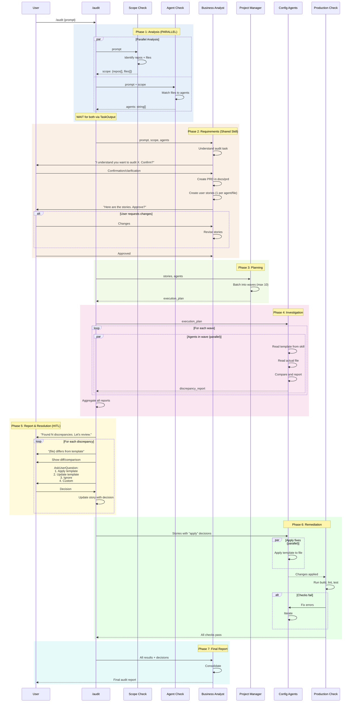
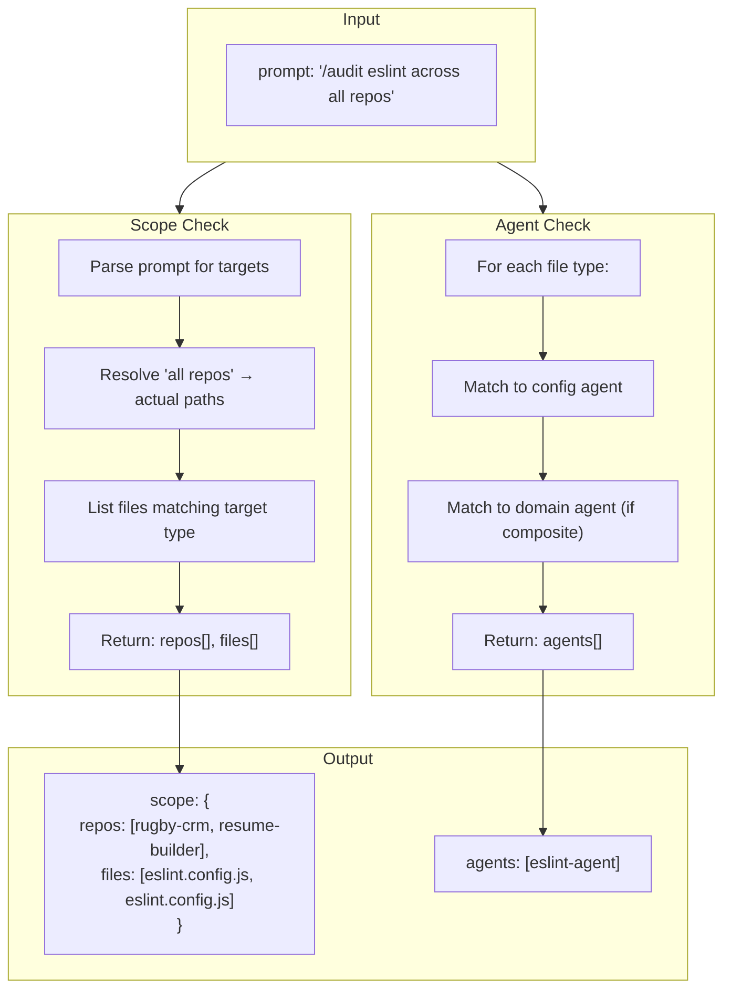
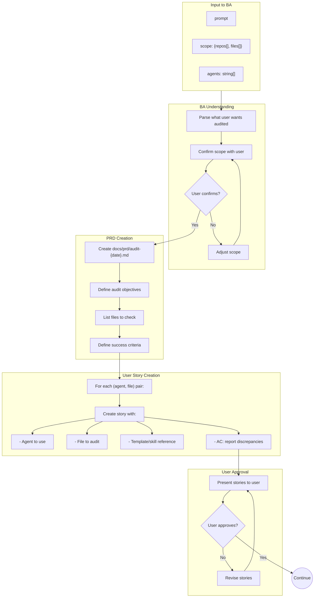
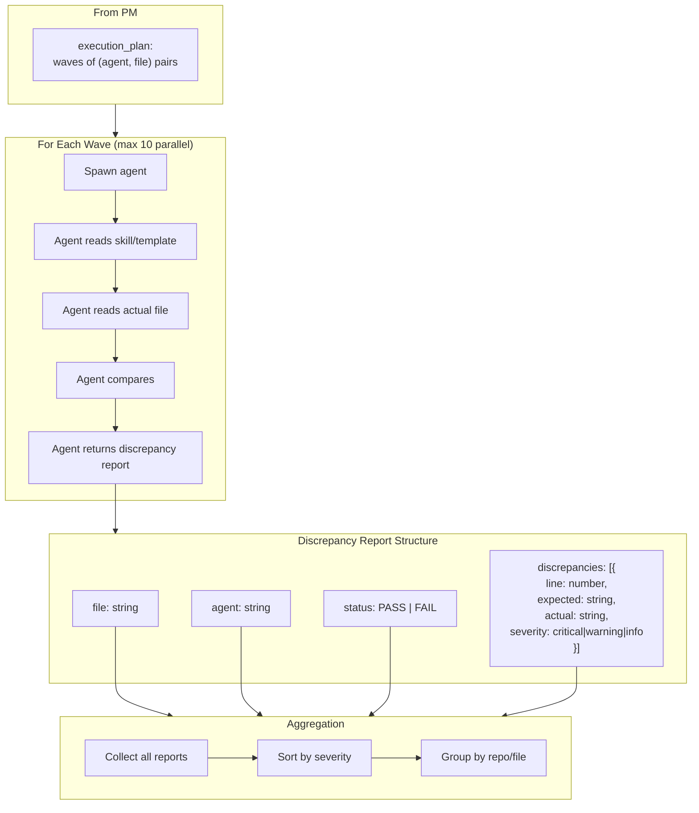
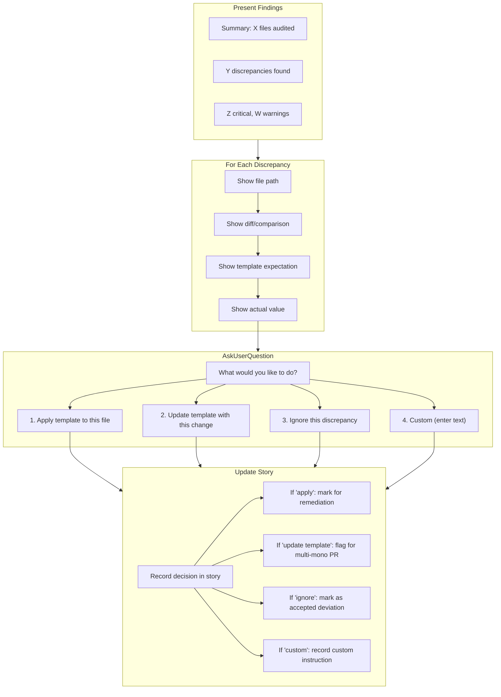
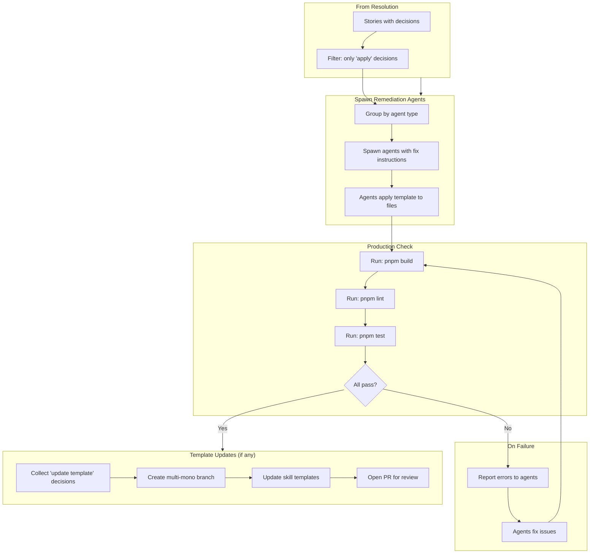
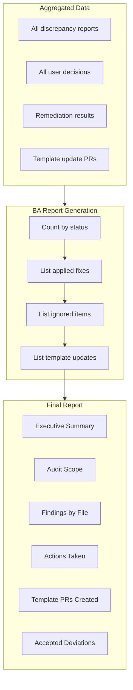

# Audit Command Target State

Simplified workflow architecture for the `/audit` command.

**Design Principles:**

- No complexity check (audit is deterministic)
- No tools check (agents are determined by scope)
- No cross-repo resolution (paths hardcoded in scope-check)
- No vibe check or innovation (audit is compliance, not creation)
- Shared Requirements phase with `/build` (reusable skill)
- Interactive discrepancy resolution (HITL per finding)
- Two-phase execution: Investigation → Remediation

---

## 1. High-Level Flow Overview

```mermaid
flowchart TB
    subgraph Entry["Phase 1: Entry"]
        A["/audit {prompt}"]
    end

    subgraph Analysis["Phase 1: Analysis (PARALLEL)"]
        SC["Scope Check<br/>(prompt) → repos[], files[]"]
        AC["Agent Check<br/>(scope) → agents[]"]
    end

    subgraph Requirements["Phase 2: Requirements (Shared Skill)"]
        BA1["BA understands task"]
        BA2["BA confirms scope with user"]
        BA3["BA creates PRD"]
        BA4["BA creates user stories<br/>(1 per agent/file combo)"]
        HV{"User approves<br/>scope + stories?"}
    end

    subgraph Planning["Phase 3: Planning"]
        PM["PM batches agents<br/>into execution waves"]
    end

    subgraph Investigation["Phase 4: Investigation"]
        INV1["Spawn agents in waves<br/>(max 10 parallel)"]
        INV2["Each agent:<br/>compare file vs template"]
        INV3["Collect discrepancy reports"]
    end

    subgraph Resolution["Phase 5: Report & Resolution (HITL)"]
        RPT["Present consolidated findings"]
        LOOP["For each discrepancy:"]
        SHOW["Show: file differs from template"]
        ASK["Ask user:<br/>1. Apply template<br/>2. Update template<br/>3. Ignore<br/>4. Custom"]
        UPD["Update story with decision"]
        MORE{"More<br/>discrepancies?"}
    end

    subgraph Remediation["Phase 6: Remediation"]
        REM1["Spawn agents to apply<br/>approved fixes"]
        REM2["Production check<br/>(build, lint, test)"]
        REM3{"Passes?"}
    end

    subgraph Report["Phase 7: Final Report"]
        FINAL["BA consolidates results"]
    end

    A --> SC & AC
    SC & AC --> BA1
    BA1 --> BA2
    BA2 --> BA3
    BA3 --> BA4
    BA4 --> HV
    HV -->|"No"| BA2
    HV -->|"Yes"| PM
    PM --> INV1
    INV1 --> INV2
    INV2 --> INV3
    INV3 --> RPT
    RPT --> LOOP
    LOOP --> SHOW
    SHOW --> ASK
    ASK --> UPD
    UPD --> MORE
    MORE -->|"Yes"| LOOP
    MORE -->|"No"| REM1
    REM1 --> REM2
    REM2 --> REM3
    REM3 -->|"No"| REM1
    REM3 -->|"Yes"| FINAL
```



---

## 2. Complete Sequence Diagram



---

## 3. Analysis Phase Detail



**Scope Check Output Examples:**

| Prompt                               | scope.repos                 | scope.files                            | agents                                   |
| ------------------------------------ | --------------------------- | -------------------------------------- | ---------------------------------------- |
| "audit eslint"                       | [current-repo]              | [eslint.config.js]                     | [eslint-agent]                           |
| "audit eslint across consumer repos" | [rugby-crm, resume-builder] | [eslint.config.js, eslint.config.js]   | [eslint-agent]                           |
| "audit monorepo root"                | [current-repo]              | [turbo.json, pnpm-workspace.yaml, ...] | [turbo-agent, pnpm-workspace-agent, ...] |
| "audit data-service"                 | [current-repo]              | [/apps/api/*]                          | [data-service-agent]                     |

**Agent Selection Logic:**

| Target Type        | Single Agent         | Composite Agents                  |
| ------------------ | -------------------- | --------------------------------- |
| eslint.config.js   | eslint-agent         | -                                 |
| docker-compose.yml | docker-compose-agent | -                                 |
| turbo.json         | turbo-agent          | -                                 |
| "monorepo root"    | -                    | All config agents for root        |
| "data-service"     | -                    | data-service-agent (orchestrates) |
| "react-app"        | -                    | react-app-agent (orchestrates)    |

---

## 4. Requirements Phase Detail (Shared Skill)



**User Story Template (Audit):**

```markdown
## Story: Audit {file} in {repo}

**Agent:** {agent-name}
**Scope:** {repo}/{path/to/file}
**Template:** {skill-name}

### Acceptance Criteria

- [ ] Agent reads template from skill
- [ ] Agent reads actual file
- [ ] Agent compares and identifies discrepancies
- [ ] Discrepancies reported with line numbers
- [ ] User decision recorded (apply/update/ignore/custom)

### User Decision

- [ ] Pending investigation
```

---

## 5. Investigation Phase Detail



**Agent Investigation Behavior:**

Each config agent in audit mode:

1. **Reads template** from its skill (e.g., `/skill eslint-config`)
2. **Reads actual file** from target repo
3. **Compares** field-by-field or line-by-line
4. **Reports** discrepancies with:
   - Exact location (line number)
   - Expected value (from template)
   - Actual value (from file)
   - Severity classification

**No changes made during investigation.** Agents only report.

---

## 6. Report & Resolution Phase Detail (HITL)



**Resolution Dialog Example:**

```
━━━━━━━━━━━━━━━━━━━━━━━━━━━━━━━━━━━━━━━━━━━━━━━━━━━━━━━━━━━━
Discrepancy 1 of 5: rugby-crm/eslint.config.js

Template expects:
  "parserOptions": { "ecmaVersion": 2024 }

Actual file has:
  "parserOptions": { "ecmaVersion": 2022 }

What would you like to do?
  [1] Apply template to this file (update to 2024)
  [2] Update template with this change (keep 2022)
  [3] Ignore this discrepancy
  [4] Other (enter text)
━━━━━━━━━━━━━━━━━━━━━━━━━━━━━━━━━━━━━━━━━━━━━━━━━━━━━━━━━━━━
```

---

## 7. Remediation Phase Detail



**Remediation Rules:**

1. **Only apply approved fixes** - No changes without user decision
2. **Batch by agent** - All eslint fixes together, all turbo fixes together
3. **Validate after each batch** - Don't accumulate breaking changes
4. **Template updates are separate** - Create PR to multi-mono, don't auto-merge

**Simplified Validation:**

| Check           | Run? | Reason                          |
| --------------- | ---- | ------------------------------- |
| build           | Yes  | Ensure no syntax errors         |
| lint            | Yes  | Ensure code quality             |
| test            | Yes  | Ensure no regressions           |
| Structure check | No   | Config agents already validated |
| DRY check       | No   | Not adding new code             |
| Config agents   | No   | They just ran in investigation  |

---

## 8. Final Report Structure



**Report Template:**

```markdown
# Audit Report: {scope}

**Date:** {date}
**Repos:** {repo-list}

## Executive Summary

Audited {N} files across {M} repositories.

- {X} discrepancies found
- {Y} fixes applied
- {Z} template updates proposed
- {W} deviations accepted

## Actions Taken

### Fixes Applied

| File                       | Change                | Agent        |
| -------------------------- | --------------------- | ------------ |
| rugby-crm/eslint.config.js | ecmaVersion 2022→2024 | eslint-agent |

### Template Updates (PRs Created)

| Template            | Change         | PR             |
| ------------------- | -------------- | -------------- |
| eslint-config skill | Add new rule X | multi-mono#123 |

### Accepted Deviations

| File                      | Deviation      | Reason                      |
| ------------------------- | -------------- | --------------------------- |
| resume-builder/turbo.json | Missing task Y | Not needed for this project |

## Verification

- Build: PASS
- Lint: PASS
- Tests: PASS
```

---

## 9. Quick Reference

| Phase | Function        | Input                 | Output              | Agent  | Parallel               |
| ----- | --------------- | --------------------- | ------------------- | ------ | ---------------------- |
| 1     | Scope Check     | prompt                | repos[], files[]    | haiku  | Yes (with Agent Check) |
| 1     | Agent Check     | prompt, scope         | agents[]            | haiku  | Yes (with Scope Check) |
| 2     | BA Requirements | prompt, scope, agents | PRD, stories        | sonnet | No                     |
| 2     | User Approval   | stories               | approved            | Human  | No                     |
| 3     | PM Planning     | stories               | execution_plan      | sonnet | No                     |
| 4     | Investigation   | execution_plan        | discrepancy_reports | haiku  | Yes (waves of 10)      |
| 5     | Report          | reports               | summary             | sonnet | No                     |
| 5     | Resolution      | discrepancies         | decisions           | Human  | No (sequential)        |
| 6     | Remediation     | decisions             | fixed_files         | haiku  | Yes (by agent type)    |
| 6     | Validation      | fixed_files           | pass/fail           | Bash   | No                     |
| 7     | Final Report    | all_data              | report              | sonnet | No                     |

---

## 10. Enforcement Rules

1. **NO complexity check** - Audit is deterministic
2. **NO tools check** - Agents determined by scope
3. **NO cross-repo resolution** - Paths hardcoded in scope-check
4. **NO vibe check** - Audit is compliance, not creation
5. **NO innovation phase** - Not applicable to audits
6. **Requirements phase uses shared skill** - Same as /build
7. **Investigation is read-only** - No changes until approved
8. **Every discrepancy gets user decision** - No auto-fixes
9. **Template updates create PRs** - Never auto-merge to multi-mono
10. **Simplified validation** - Just build/lint/test, no config agents

---

## 11. Comparison: /audit vs /build

| Phase        | /audit                            | /build                            |
| ------------ | --------------------------------- | --------------------------------- |
| Analysis     | Scope + Agent check               | Complexity + Tools + Scope        |
| Cross-repo   | Hardcoded in scope                | Hardcoded in scope                |
| Requirements | Shared skill (BA → PRD → Stories) | Shared skill (BA → PRD → Stories) |
| Vibe Check   | Skip                              | Required (≥15)                    |
| Innovation   | Skip                              | Optional (≥30)                    |
| Design       | PM batches agents                 | Architect + PM                    |
| Execution    | Investigation (read-only)         | TDD pairs (write)                 |
| HITL         | Per-discrepancy decisions         | Approval before execution         |
| Remediation  | Apply approved fixes              | N/A (part of execution)           |
| Validation   | build/lint/test only              | Full standards audit              |
| Report       | BA consolidates                   | BA consolidates                   |

---

## 12. Open Questions

1. **Should scope-check and agent-check be one skill or two?**
   - Combined: simpler, single call
   - Separate: more reusable, agent-check could be used elsewhere

2. **How to handle "update template" decisions?**
   - Auto-create PR to multi-mono?
   - Just log for manual action?
   - Create branch but require manual PR?

3. **What if user wants to audit but NOT fix?**
   - Add "report only" mode?
   - Or just let them choose "ignore" for everything?

4. **Batching discrepancy questions:**
   - Ask one-by-one (current design)?
   - Group by file and ask batch decisions?
   - Show all, let user mark multiple?
