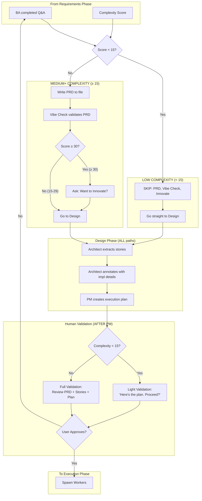

# Build Command Target State

Target workflow architecture for the `/build` command using Mermaid diagrams.

---

## 1. High-Level Flow Overview

```mermaid
flowchart TB
    subgraph Entry["1. Entry Point"]
        A["/build {prompt}"]
    end

    subgraph Analysis["2. Analysis Phase (PARALLEL)"]
        B["Complexity Check<br/>(prompt) → int"]
        C["Tool Check<br/>(prompt) → string[]"]
        D["Scope Check<br/>(prompt) → string[]"]
    end

    subgraph Requirements["3. Requirements Phase (HITL)"]
        E["Business Analyst<br/>Drafts requirements"]
        E2{"BA has questions?"}
        G["Ask User for Clarification"]
        E3["BA completes understanding"]
    end

    ROUTE{"Complexity<br/>< 15?"}

    subgraph LowComplexity["LOW COMPLEXITY PATH (< 15)"]
        LC1["Skip PRD, Vibe Check"]
    end

    subgraph HighComplexity["MEDIUM+ COMPLEXITY PATH (≥ 15)"]
        PRD["Write PRD file"]
        VC{"Vibe Check<br/>(prd) → bool"}
        HC{"Score ≥ 30?"}
        I["Ask: Want to Innovate?"]
        IA["Innovation Advisor"]
    end

    subgraph Design["4. Design Phase"]
        O["Architect<br/>Extracts & annotates stories"]
        P["Project Manager<br/>Creates execution plan"]
    end

    subgraph Validation["5. Human Validation (HITL)"]
        HV_CHECK{"Complexity < 15?"}
        HV_LOW["Light: 'Proceed?'"]
        HV_HIGH["Full: Review PRD + Stories + Plan"]
        HV{"User Approves?"}
    end

    subgraph Execution["6. Execution Phase (TDD per Story)"]
        WAVE_START["For each wave:"]
        PERSIST["1. Update story files<br/>(persist state)"]
        COMPACT["2. Compact context"]
        PAIRS["3. Spawn paired agents<br/>(tester → impl) per story"]
        WAVE_CHECK{"Wave complete?"}
        R{"Production Check<br/>tests pass + AC verified"}
    end

    subgraph Audit["7. Standards Audit"]
        SA_CONFIG["Config Agents<br/>(parallel)"]
        SA_STRUCT["Structure Check"]
        SA_DRY["DRY Check<br/>(vs multi-mono)"]
        SA_RESULT{"All Pass?"}
    end

    subgraph Output["8. Report"]
        T["Business Analyst<br/>Final Report to User"]
    end

    A --> B & C & D
    B & C & D --> E
    E --> E2
    E2 -->|"Yes"| G
    G -->|"User answers"| E
    E2 -->|"No"| E3
    E3 --> ROUTE

    ROUTE -->|"Yes (< 15)"| LC1
    LC1 --> O

    ROUTE -->|"No (≥ 15)"| PRD
    PRD --> VC
    VC -->|"❌ Fails"| E3
    VC -->|"✅ Pass"| HC
    HC -->|"Yes (≥ 30)"| I
    I -->|"Yes"| IA
    IA --> O
    I -->|"No"| O
    HC -->|"No (15-29)"| O

    O --> P
    P --> HV_CHECK

    HV_CHECK -->|"Yes"| HV_LOW
    HV_CHECK -->|"No"| HV_HIGH
    HV_LOW --> HV
    HV_HIGH --> HV

    HV -->|"❌ Changes requested"| E3
    HV -->|"✅ Approved"| WAVE_START
    WAVE_START --> PERSIST
    PERSIST --> COMPACT
    COMPACT --> PAIRS
    PAIRS --> WAVE_CHECK
    WAVE_CHECK -->|"More waves"| WAVE_START
    WAVE_CHECK -->|"All done"| R
    R -->|"❌ Fails"| PAIRS
    R -->|"✅ Pass"| SA_CONFIG
    SA_CONFIG --> SA_STRUCT
    SA_STRUCT --> SA_DRY
    SA_DRY --> SA_RESULT
    SA_RESULT -->|"❌ Violations"| PAIRS
    SA_RESULT -->|"✅ Pass"| T
```



---

## 2. Complexity-Based Routing Detail



---

## 3. Complete Sequence Diagram

```mermaid
sequenceDiagram
    participant U as User
    participant CMD as /build
    participant CC as Complexity Check
    participant TC as Tool Check
    participant SC as Scope Check
    participant BA as Business Analyst
    participant VC as Vibe Check
    participant IA as Innovation Advisor
    participant AR as Architect
    participant PM as Project Manager
    participant W as Workers
    participant PC as Production Check

    U->>CMD: /build {prompt}

    rect rgb(230, 240, 250)
        Note over CC,SC: Phase 1: Analysis (PARALLEL)
        par Parallel Analysis
            CMD->>CC: prompt
            CC-->>CMD: complexity: int
        and
            CMD->>TC: prompt
            TC-->>CMD: tools: string[]
        and
            CMD->>SC: prompt
            SC-->>CMD: scope: string[]
        end
    end

    rect rgb(250, 240, 230)
        Note over BA: Phase 2: Requirements (HITL)
        CMD->>BA: prompt, complexity, tools, scope
        BA->>BA: Understand requirements

        loop BA Clarification Loop
            alt BA has questions
                BA->>U: Clarification questions
                U->>BA: Answers
            end
        end

        BA->>BA: Complete understanding
    end

    rect rgb(255, 250, 200)
        Note over BA,VC: Phase 3: Complexity Routing
        alt Low Complexity (< 15)
            Note over CMD: SKIP: PRD, Vibe Check, Innovate
        else Medium+ Complexity (≥ 15)
            BA->>BA: Write PRD
            BA-->>VC: prd
            alt Vibe Check Fails
                VC->>BA: Issues found
                BA->>BA: Revise PRD
            end
            VC-->>CMD: ✅ PRD validated

            alt Enterprise Complexity (≥ 30)
                CMD->>U: Want to innovate?
                alt Yes
                    CMD->>IA: Analyze PRD
                    IA-->>CMD: Structured innovations (JSON)
                    loop For each innovation
                        CMD->>U: Innovation 1-pager + AskUserQuestion
                        alt Implement
                            Note over CMD: Add to selections
                        else Skip
                            Note over CMD: Continue
                        else More Details
                            CMD->>U: Full explanation
                            CMD->>U: AskUserQuestion (Implement/Skip)
                        end
                    end
                    CMD->>BA: Selected innovations
                    BA->>BA: Update PRD
                end
            end
        end
    end

    rect rgb(240, 250, 230)
        Note over AR,PM: Phase 4: Design (ALL paths)
        CMD->>AR: requirements (or PRD)
        AR->>AR: Extract user stories
        AR->>AR: Annotate with impl details
        AR-->>PM: annotated stories
        PM->>PM: Create execution plan
        PM-->>CMD: execution_plan
    end

    rect rgb(255, 245, 238)
        Note over U: Phase 5: Human Validation (AFTER PM)
        alt Low Complexity (< 15)
            CMD->>U: "Here's the plan: [summary]. Proceed?"
            alt User confirms
                U->>CMD: "proceed" / "looks good"
            else User wants changes
                U->>CMD: Changes requested
                CMD->>BA: Revise
            end
        else Medium+ Complexity (≥ 15)
            CMD->>U: Review PRD + Stories + Execution Plan
            alt User approves
                U->>CMD: ✅ Approved
            else User requests changes
                U->>CMD: Changes requested
                CMD->>BA: Revise
            end
        end
    end

    rect rgb(250, 230, 240)
        Note over W,PC: Phase 6: Execution (TDD per Story + Compact)
        CMD->>CMD: Load execution_plan

        loop For each wave
            Note over CMD: 1. Update story files (persist state)
            CMD->>CMD: Write progress to story files

            Note over CMD: 2. Compact context
            CMD->>CMD: /compact (free context for wave)

            Note over CMD: 3. Spawn paired agents per story
            par Stories in wave (parallel pairs)
                Note over W: Story A: tester → impl
                CMD->>W: Spawn tester for Story A
                W->>W: Write tests for AC
                W-->>CMD: Tests ready
                CMD->>W: Spawn impl agent for Story A
                W->>W: Implement to pass tests
                W-->>PC: Code + tests
            and
                Note over W: Story B: tester → impl
                CMD->>W: Spawn tester for Story B
                W->>W: Write tests for AC
                W-->>CMD: Tests ready
                CMD->>W: Spawn impl agent for Story B
                W->>W: Implement to pass tests
                W-->>PC: Code + tests
            end

            PC->>PC: Production Check (tests + AC verified)
            alt Tests fail OR AC not met
                PC->>W: Fix required
                W->>W: Iterate until AC met
            end
        end

        PC-->>CMD: ✅ All waves complete, tests pass, AC verified
    end

    rect rgb(255, 240, 245)
        Note over CMD: Phase 7: Standards Audit
        par Config Agents (parallel)
            CMD->>CMD: docker-compose-agent
            CMD->>CMD: eslint-agent
            CMD->>CMD: env-example-agent
            CMD->>CMD: (relevant agents)
        end
        CMD->>CMD: Structure Check (files in right places)
        CMD->>CMD: DRY Check (vs multi-mono libs/components)

        alt Violations Found
            CMD->>W: Fix violations
            W->>W: Apply fixes
            W-->>PC: Re-run checks
        end
        CMD-->>CMD: ✅ Standards pass
    end

    rect rgb(230, 250, 250)
        Note over BA: Phase 8: Report
        CMD->>BA: All results
        BA-->>U: Final report
    end
```



---

## 4. Quick Reference

| Phase | Function           | Low (<15)             | Medium (15-29)                 | Enterprise (≥30)               |
| ----- | ------------------ | --------------------- | ------------------------------ | ------------------------------ |
| 1     | Analysis           | ✅ PARALLEL           | ✅ PARALLEL                    | ✅ PARALLEL                    |
| 2     | BA Q&A             | ✅ HITL               | ✅ HITL                        | ✅ HITL                        |
| 3a    | PRD                | ⏭️ SKIP               | ✅ Required                    | ✅ Required                    |
| 3b    | Vibe Check         | ⏭️ SKIP               | ✅ Required                    | ✅ Required                    |
| 3c    | Innovate           | ⏭️ SKIP               | ⏭️ SKIP                        | ✅ Optional                    |
| 4     | Design (Arch + PM) | ✅ Required           | ✅ Required                    | ✅ Required                    |
| 5     | Human Validation   | ✅ Light ("Proceed?") | ✅ Full (PRD + Plan)           | ✅ Full (PRD + Plan)           |
| 6     | Execution          | ✅ TDD pairs          | ✅ TDD pairs (waves + compact) | ✅ TDD pairs (waves + compact) |
| 7     | Standards Audit    | ✅ Config+Struct+DRY  | ✅ Config+Struct+DRY           | ✅ Config+Struct+DRY           |
| 8     | Report             | ✅ BA Report          | ✅ BA Report                   | ✅ BA Report                   |

---

## 5. Human Validation Details

**ALWAYS happens AFTER PM, BEFORE Execution.**

### Low Complexity (< 15) - Light Validation

BA presents:

- Brief approach summary
- Files that will be affected
- Execution plan overview

User responds with:

- "proceed" / "go ahead" / "looks good" → Start Execution
- "wait" / "let me see more" → Show full details
- Changes requested → Return to BA

### Medium+ Complexity (≥ 15) - Full Validation

User reviews:

- PRD (requirements document)
- User stories (work breakdown)
- Architecture annotations
- Execution plan (waves, parallelization)

User responds with:

- Approved → Start Execution
- Changes requested → Return to BA

---

## 6. Standards Audit Details

**ALWAYS happens AFTER Execution passes (build/lint/test), BEFORE Report.**

**Skills:** `/skill agent-selection`, `/skill structure-check`, `/skill dry-check`

### 6a. Config Agents (Parallel)

Use `/skill agent-selection` to find the correct agent for each config file modified.

Each agent runs in **audit mode** against its skill/templates.

### 6b. Structure Check

Use `/skill structure-check` to validate files are in the correct locations per domain skills:

| Package Type | Check                                 | Violation Example                     |
| ------------ | ------------------------------------- | ------------------------------------- |
| React App    | UI in /features, light /pages         | All UI in /pages instead of /features |
| API Service  | Routes in /routes, logic in /services | Business logic in route handlers      |
| Database     | Schema in /prisma, types exported     | Types not exported from index         |

Uses domain skills: `react-app-structure`, `data-service-structure`, etc.

### 6c. DRY Check (Library/Component Discovery)

Use `/skill dry-check` to scan new code against shared libraries:

**multi-mono packages/ to check:**

- `@metasaver/core-utils` - string helpers (capitalize, toKebabCase, cn)
- `@metasaver/core-service-utils` - service factory, middleware, auth
- `@metasaver/core-database` - database client utilities

**multi-mono components/ to check:**

- `@metasaver/core-components` - ZButton, ZCard, ZDataTable, ZErrorBoundary
- `@metasaver/core-layouts` - ZAdminLayout, ZUserDropdown

**What it catches:**

```
❌ VIOLATION: text.ts:capitalize()
   duplicates @metasaver/core-utils.capitalize()

❌ VIOLATION: Button.tsx created locally
   Use @metasaver/core-components.ZButton instead
```

### 6d. On Failure

If any violations found:

1. Report violations to workers
2. Workers apply fixes
3. Re-run Production Check (build/lint/test)
4. Re-run Standards Audit
5. Loop until all pass

---

## 7. Architect: Library/Component Discovery (Design Phase)

**MANDATORY before designing implementation.**

The Architect must check multi-mono for existing utilities and components:

### multi-mono Packages (Utilities)

| Package                          | Contents                           | Example Exports                                  |
| -------------------------------- | ---------------------------------- | ------------------------------------------------ |
| `@metasaver/core-utils`          | String, color, style, test helpers | `capitalize`, `toKebabCase`, `toCamelCase`, `cn` |
| `@metasaver/core-service-utils`  | Service factory, middleware, auth  | `createService`, `authMiddleware`, `healthCheck` |
| `@metasaver/core-database`       | Database client utilities          | `createClient`, database types                   |
| `@metasaver/core-agent-utils`    | Agent factory patterns             | Agent utilities for rapid development            |
| `@metasaver/core-mcp-utils`      | MCP server utilities               | MCP server factory patterns                      |
| `@metasaver/core-workflow-utils` | Workflow with HITL                 | LangGraph workflow utilities                     |

### multi-mono Components (React)

| Package                      | Contents           | Example Exports                                     |
| ---------------------------- | ------------------ | --------------------------------------------------- |
| `@metasaver/core-components` | Core UI components | `ZButton`, `ZCard`, `ZDataTable`, `ZErrorBoundary`  |
| `@metasaver/core-layouts`    | Layout components  | `ZAdminLayout`, `ZUserDropdown`, `useImpersonation` |

### Process

1. **Before** writing architecture notes, search multi-mono:

   ```
   packages/utils/src/index.ts
   packages/service-utils/src/index.ts
   components/core/src/index.ts
   components/layouts/src/index.ts
   ```

2. **List** discovered utilities in architecture notes:

   ```markdown
   ## Available Utilities

   - String: capitalize, toKebabCase, toCamelCase (@metasaver/core-utils)
   - Style: cn (@metasaver/core-utils)
   - Service: createService, healthCheck (@metasaver/core-service-utils)
   - Components: ZButton, ZCard, ZDataTable (@metasaver/core-components)
   ```

3. **Reference** in story annotations:

   ```markdown
   Implementation Notes:

   - Use @metasaver/core-utils.capitalize() for name formatting
   - Use @metasaver/core-components.ZButton for buttons
   - Use @metasaver/core-service-utils factory for new services
   ```

This prevents DRY violations at the Standards Audit phase.

---

## 8. User Trigger Phrases

**Phrases that approve (proceed to Execution):**

- "proceed"
- "go ahead"
- "you got it"
- "sounds good"
- "do it"
- "yes"
- "looks good"
- "approved"

**Phrases that request changes (return to BA):**

- "wait"
- "hold on"
- "change X to Y"
- "I want to modify..."
- "actually..."

---

## 9. Model Selection

| Complexity | BA/Architect | Workers | Thinking   |
| ---------- | ------------ | ------- | ---------- |
| <15        | sonnet       | sonnet  | none       |
| 15-29      | sonnet       | sonnet  | think      |
| ≥30        | opus         | sonnet  | ultrathink |

---

## 10. Phase Comparison: /build vs /audit

| Phase            | /audit       | /build (<15) | /build (15-29) | /build (≥30) |
| ---------------- | ------------ | ------------ | -------------- | ------------ |
| Analysis         | ✅ Same      | ✅ Same      | ✅ Same        | ✅ Same      |
| BA Q&A           | ✅ HITL      | ✅ HITL      | ✅ HITL        | ✅ HITL      |
| PRD              | ✅ Required  | ⏭️ Skip      | ✅ Required    | ✅ Required  |
| Vibe Check       | ✅ Single    | ⏭️ Skip      | ✅ Single      | ✅ Single    |
| Innovate         | ❌ Skip      | ⏭️ Skip      | ❌ Skip        | ✅ Optional  |
| Design           | ✅ Arch + PM | ✅ Arch + PM | ✅ Arch + PM   | ✅ Arch + PM |
| Human Validation | ✅ After PM  | ✅ Light     | ✅ Full        | ✅ Full      |
| Execution        | ✅ Workers   | ✅ Workers   | ✅ Workers     | ✅ Workers   |
| Standards Audit  | ✅ Same      | ✅ Same      | ✅ Same        | ✅ Same      |
| Report           | ✅ BA Report | ✅ BA Report | ✅ BA Report   | ✅ BA Report |
