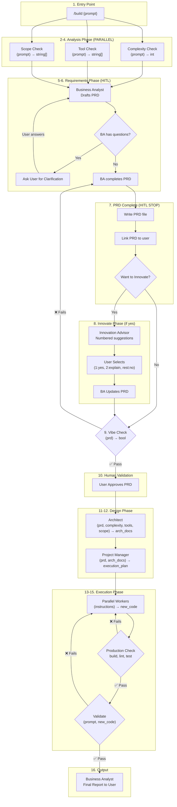
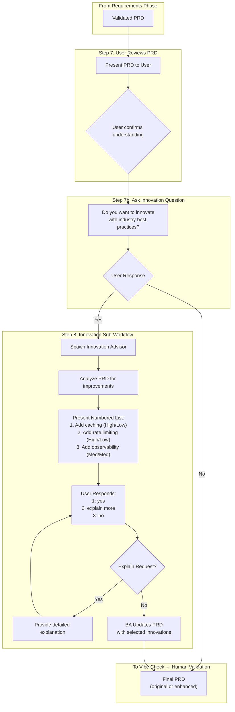
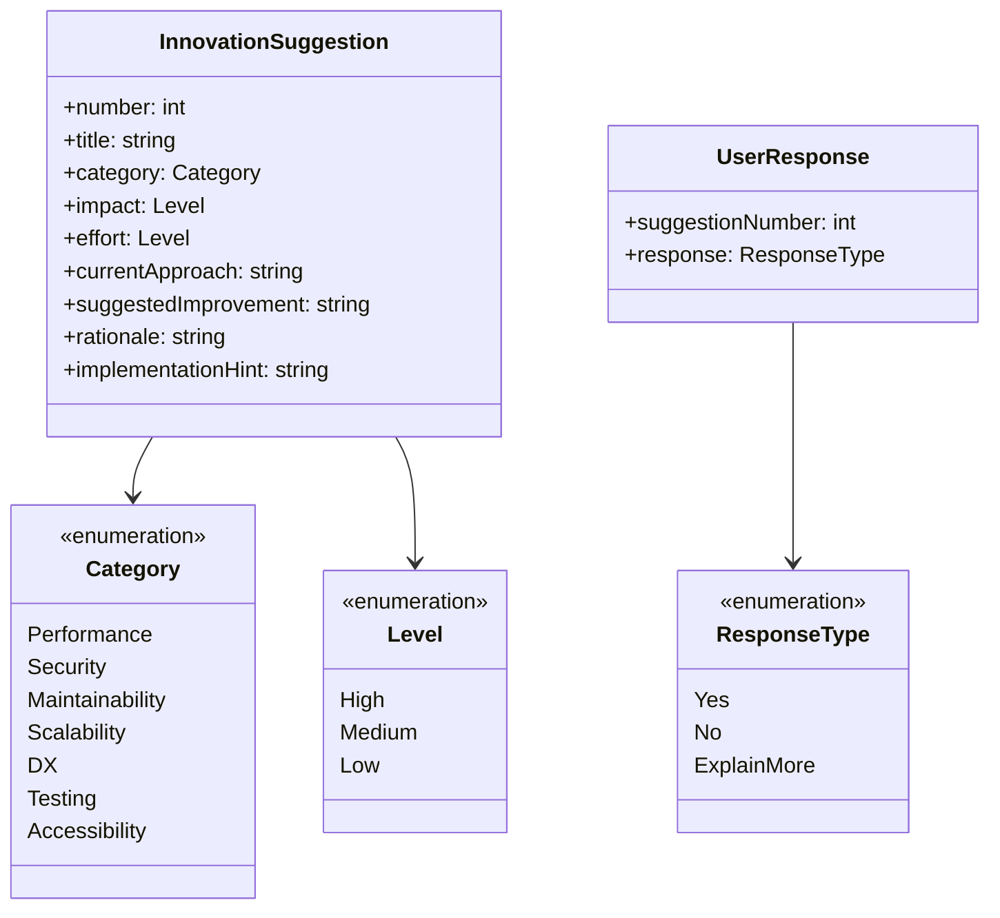
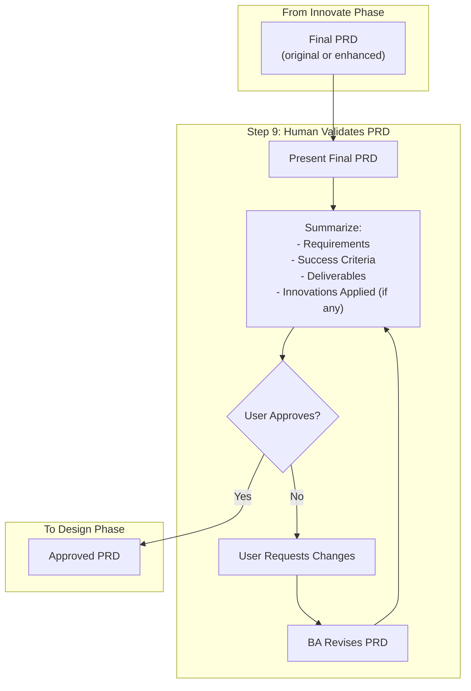
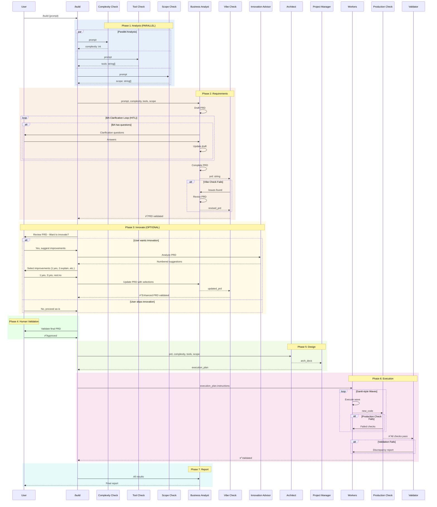

# Build Command Target State

Target workflow architecture for the `/build` command using Mermaid diagrams.

**Key difference from /audit:** Includes Innovate phase for PRD enhancement before Architecture.

---

## 1. High-Level Flow Overview

---

## 2. Innovate Phase Detail

---

## 3. Innovation Advisor Output Format

---

## 4. Human Validation Phase

---

## 5. Complete Sequence Diagram

---

## 6. Quick Reference

| Step | Function           | Input                            | Output         | Model        | Parallel |
| ---- | ------------------ | -------------------------------- | -------------- | ------------ | -------- |
| 1    | Entry              | prompt                           | -              | -            | -        |
| 2    | Complexity Check   | prompt                           | int            | haiku        | ✅ 2-4   |
| 3    | Tool Check         | prompt                           | string[]       | haiku        | ✅ 2-4   |
| 4    | Scope Check        | prompt                           | string[]       | haiku        | ✅ 2-4   |
| 5    | BA Draft PRD       | prompt, complexity, tools, scope | draft_prd      | sonnet       | -        |
| 6    | BA Clarifications  | draft_prd                        | questions      | sonnet       | HITL     |
| 7    | User Review PRD    | prd                              | approval       | Human        | -        |
| 8    | Innovation Advisor | prd                              | numbered list  | sonnet       | Optional |
| 9    | User Selection     | suggestions                      | selections     | Human        | Optional |
| 10   | BA Update PRD      | prd, selections                  | enhanced_prd   | sonnet       | Optional |
| 11   | Vibe Check         | final_prd                        | bool \| issues | MCP Tool     | -        |
| 12   | Human Validation   | final_prd                        | approval       | Human        | -        |
| 13   | Architect          | prd, complexity, tools, scope    | arch_docs      | sonnet       | -        |
| 14   | Project Manager    | prd, arch_docs                   | execution_plan | sonnet       | -        |
| 15   | Workers            | instructions                     | new_code       | haiku/sonnet | ✅ waves |
| 16   | Production Check   | new_code                         | bool           | Bash         | -        |
| 17   | Validate           | prompt, new_code                 | bool           | sonnet       | -        |
| 18   | Business Analyst   | results                          | report         | sonnet       | -        |

---

## 7. Phase Comparison: /build vs /audit

| Phase               | /audit              | /build              |
| ------------------- | ------------------- | ------------------- |
| 1. Analysis         | ✅ Same             | ✅ Same             |
| 2. Requirements     | ✅ BA (HITL)        | ✅ BA (HITL)        |
| 3. Innovate         | ❌ Skip             | ✅ Optional         |
| 4. Vibe Check       | ✅ Single           | ✅ Single           |
| 5. Human Validation | If complexity ≥15   | ✅ Required         |
| 6. Design           | ✅ Architect + PM   | ✅ Architect + PM   |
| 7. Execution        | ✅ Workers + Checks | ✅ Workers + Checks |
| 8. Report           | ✅ BA Report        | ✅ BA Report        |

**Why /audit skips Innovate:**

- Audit is for compliance checking against existing standards
- Innovation would change requirements, not validate them
- Audit PRDs define "what to check", not "what to build"

**Why /build has Innovate:**

- Build creates new features that benefit from best practices
- Innovation advisor catches missing patterns early
- PRDs can be enhanced before architecture locks decisions
