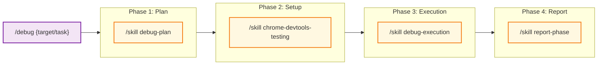
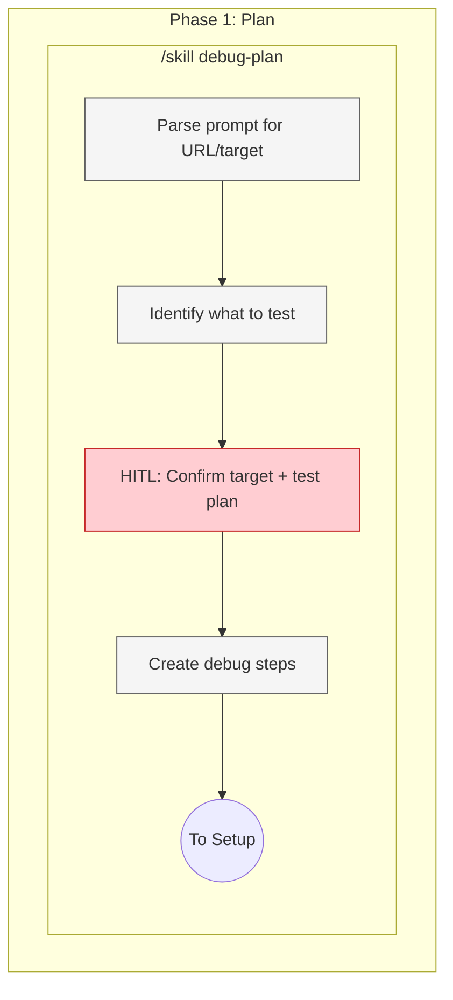
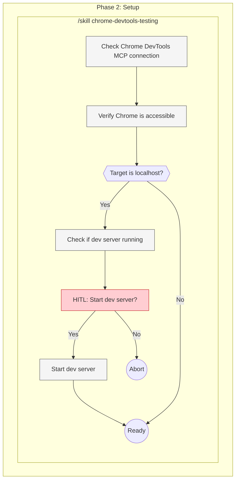
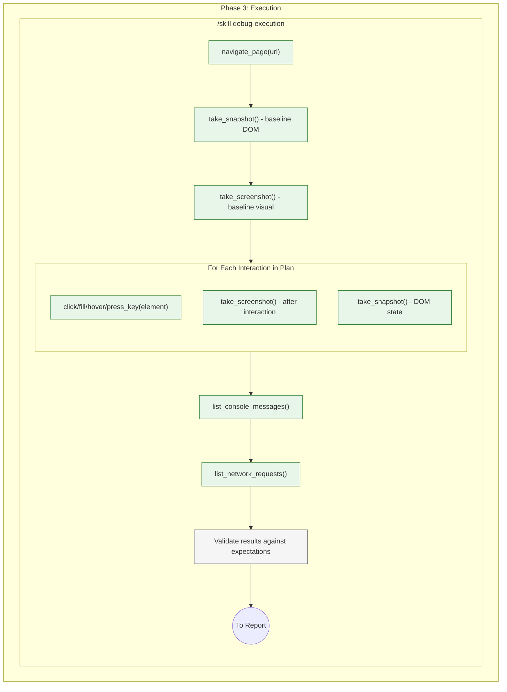
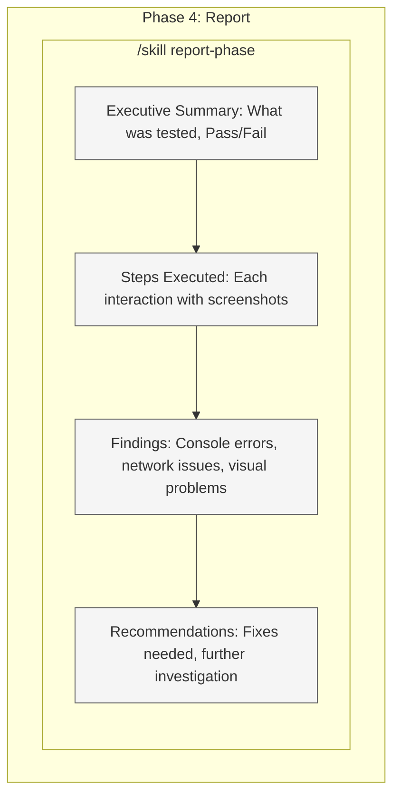

# Debug Command Target State

Target workflow architecture for the `/debug` command - browser debugging and E2E testing with Chrome DevTools MCP.

**Purpose:** Debug web applications, test UI interactions, capture visual evidence.

**Prerequisite:** Chrome DevTools MCP server configured and Chrome running with remote debugging.

---

## 1. High-Level Workflow (Skills Only)



**Legend:**

| Color  | Meaning         |
| ------ | --------------- |
| Purple | Entry point     |
| Blue   | Phase container |
| Yellow | Skill           |

---

## 2. Phase 1: Plan (Exploded)

**Execution:** Quick planning - extract URL and create simple test plan



**Output:** URL + simple test plan (what to click, what to check)

---

## 3. Phase 2: Setup (Exploded)

**Execution:** Sequential



**Output:** Chrome DevTools MCP connected, dev server running (if needed)

---

## 4. Phase 3: Execution (Exploded)

**Execution:** Sequential - MCP tool calls



**MCP Tools Used:**

| Tool                    | Purpose              |
| ----------------------- | -------------------- |
| `navigate_page`         | Navigate to URL      |
| `take_snapshot`         | Get DOM snapshot     |
| `take_screenshot`       | Capture visual state |
| `click`                 | Click element        |
| `fill`                  | Input text           |
| `hover`                 | Hover over element   |
| `press_key`             | Keyboard input       |
| `list_console_messages` | Get console logs     |
| `list_network_requests` | Get network activity |

**Output:** All evidence captured

---

## 5. Phase 4: Report (Exploded)

**Execution:** Sequential



**Output:** Complete debug report in markdown with screenshots

---

## 6. Quick Reference

| Phase | Skill                            | Agent         | Model  |
| ----- | -------------------------------- | ------------- | ------ |
| 1     | `/skill debug-plan`              | -             | sonnet |
| 2     | `/skill chrome-devtools-testing` | -             | -      |
| 3     | `/skill debug-execution`         | - (MCP tools) | -      |
| 4     | `/skill report-phase`            | -             | sonnet |

---

## 7. Examples

```bash
# Debug specific page
/debug "check if the login form works"
→ P1: Plan: URL=localhost:5173/login, test login with test@test.com
→ P2: Setup Chrome DevTools MCP
→ P3: Execute: Navigate, fill form, submit, capture screenshots
→ P4: Report: Login successful, redirected to /dashboard

# Visual debugging
/debug "the modal isn't centered on mobile"
→ P1: Plan: URL=localhost:5173/users, resize to 375px, open modal
→ P2: Setup
→ P3: Execute: Resize, open modal, capture
→ P4: Report: Modal offset by 20px left, CSS issue identified

# E2E flow test
/debug "test the checkout flow"
→ P1: Plan: Full flow - add to cart, checkout, payment
→ P2: Setup
→ P3: Execute full flow with screenshots at each step
→ P4: Report: Flow completed successfully

# Console error investigation
/debug "there's a React error on the settings page"
→ P1: Plan: Navigate to settings, click Save, capture console
→ P2: Setup
→ P3: Execute, capture console messages
→ P4: Report: "Cannot read property 'map' of undefined" at Settings.tsx:42
```

---

## 8. Enforcement Rules

1. Plan phase confirms URL + test steps with user (quick HITL)
2. Check Chrome DevTools MCP connection before execution
3. Capture screenshots at each step
4. Always capture console messages
5. Always capture network requests (for debugging)
6. Report must include all evidence
7. Never auto-fix - report findings only

---

## 9. Prerequisites

**Chrome Setup:**

```bash
# Start Chrome with remote debugging
google-chrome --remote-debugging-port=9222 --user-data-dir=/tmp/chrome-debug
```

**Dev Server:**

```bash
# Ensure dev server uses host 0.0.0.0 for container access
pnpm dev --host 0.0.0.0
```

**MCP Configuration:**

- Chrome DevTools MCP server must be configured in `.mcp.json`
- See `/skill chrome-devtools-testing` for setup details
