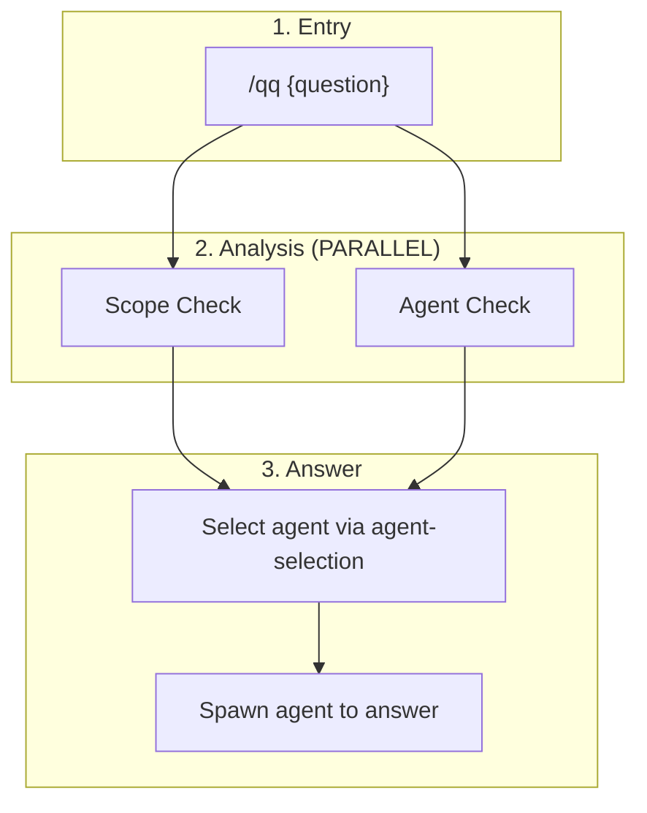
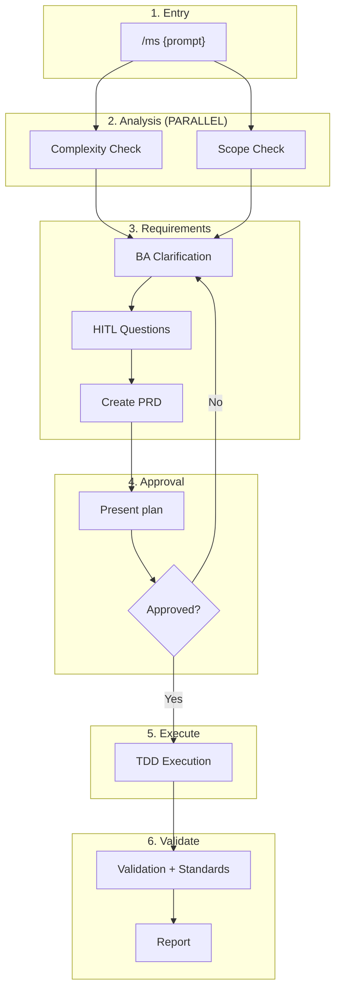
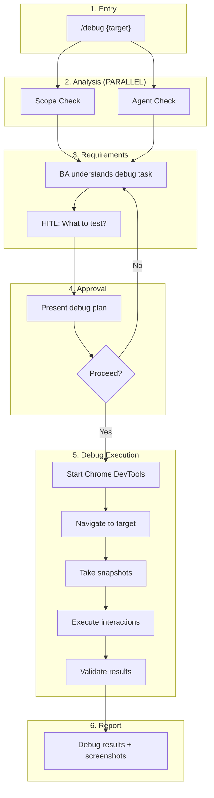
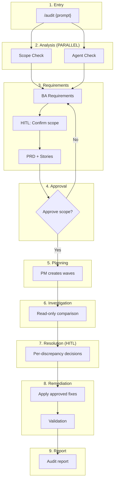
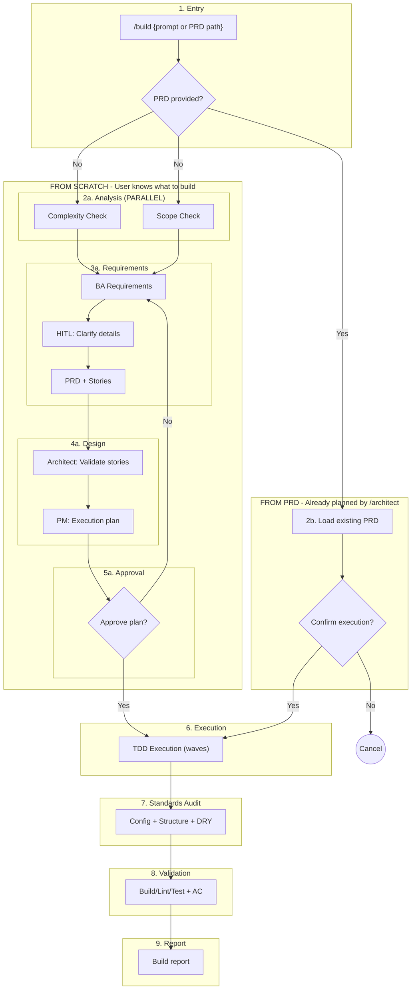
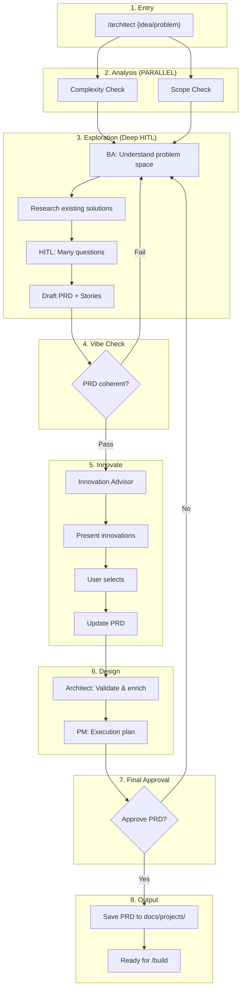

# PRD: Command and Skill Restructuring

**Date:** 2025-12-17
**Status:** Superseded (~85% complete)
**Author:** Claude + User
**Superseded By:** MSM007 (tool-check cleanup remaining work)
**Completion Notes:** Most work completed via MSM004-006. Remaining items (tool-check deletion, standards-audit creation) moved to MSM007.

---

## 1. Executive Summary

Restructure MetaSaver commands and skills to:

- Remove unnecessary complexity (tool-check)
- Consolidate duplicate patterns into reusable skills
- Create clear separation between phases
- Add new commands (/architect, /qq)
- Fix /debug placeholder

---

## 2. Current State Problems

### 2.1 Redundant/Unnecessary Skills

- `tool-check` - Not providing value, remove entirely

### 2.2 Inconsistent Patterns

- Analysis phase varies across commands without clear reason
- Requirements phase duplicated with slight variations
- Approval/HITL patterns differ unnecessarily
- Commands reference skills that don't exist

### 2.3 Missing Skills

- `vibe-check` - Referenced but doesn't exist
- Audit-specific skills (investigation, resolution, remediation)

### 2.4 Commands Need Work

- `/ms` - Missing Entry Handling, references wrong skills
- `/build` - Inline tables, wrong Phase 1 checks
- `/audit` - References non-existent skills
- `/debug` - Placeholder, needs real workflow
- `/architect` - Doesn't exist (should exist)
- `/qq` - Doesn't exist (quick question command)

---

## 3. Target State

### 3.1 Command Portfolio

| Command      | Purpose                                        | When to use                  | Output |
| ------------ | ---------------------------------------------- | ---------------------------- | ------ |
| `/qq`        | Quick question - answer using MetaSaver agents | Need an answer               | Answer |
| `/ms`        | Semi-freeform task handler                     | Small tasks                  | Code   |
| `/debug`     | Browser debugging with Chrome DevTools         | Testing UI                   | Report |
| `/audit`     | Validate existing code against standards       | Check compliance             | Fixes  |
| `/build`     | Build known features with TDD                  | **Know what to build**       | Code   |
| `/architect` | Explore, plan, innovate - creates PRD          | **Don't know what to build** | PRD    |

### 3.2 Skill Categories

**Cross-Cutting (atomic, reusable):**

- `complexity-check` - Returns score 1-50
- `scope-check` - Returns targets[], references[]
- `agent-check` - Returns agents[]
- `agent-selection` - Maps files to agents
- `structure-check` - Validates file locations
- `dry-check` - Checks against multi-mono
- `repomix-cache-refresh` - Refreshes cache after changes

**Workflow Steps (phase-specific):**

- `requirements-phase` - BA + HITL + PRD + Stories (consolidated)
- `vibe-check` - PRD quality gate
- `innovate-phase` - Enhancement suggestions
- `architect-phase` - Validate & enrich stories (NEW)
- `pm-phase` - Create execution plan/Gantt (NEW)
- `hitl-approval` - Validate PRD/stories before execution
- `execution-phase` - TDD pairs for /ms and /build
- `audit-investigation` - Read-only comparison (NEW)
- `audit-resolution` - Per-discrepancy HITL (NEW)
- `audit-remediation` - Apply approved fixes (NEW)
- `validation-phase` - Build/lint/test + AC verification
- `standards-audit` - Config agents + structure + DRY
- `report-phase` - Summarize request + actions taken

---

## 4. Skills to Remove

### 4.1 tool-check

**Reason:** Not providing value. Commands don't need to know MCP tools upfront.

**Action:**

- Delete `plugins/metasaver-core/skills/cross-cutting/tool-check/`
- Delete `plugins/metasaver-core/agents/generic/tool-check-agent.md`
- Remove all references in commands and other skills

---

## 5. Skills to Create

### 5.1 vibe-check

**Location:** `workflow-steps/vibe-check/SKILL.md`
**Purpose:** PRD quality gate using MCP vibe_check tool
**Used by:** /build, /architect

### 5.2 architect-phase

**Location:** `workflow-steps/architect-phase/SKILL.md`
**Purpose:**

- Check if solution already exists in multi-mono
- Find example files to use as reference
- Validate against Context7 docs
- Enrich user stories with implementation details
  **Used by:** /build, /architect

### 5.3 pm-phase

**Location:** `workflow-steps/pm-phase/SKILL.md`
**Purpose:**

- Take enriched user stories
- Create execution plan (Gantt chart)
- Define waves for parallel execution
  **Used by:** /build, /architect, /audit

### 5.4 hitl-approval

**Location:** `workflow-steps/hitl-approval/SKILL.md`
**Purpose:** Single approval gate for PRD + user stories
**Used by:** All commands that need user approval before execution

### 5.5 audit-investigation

**Location:** `workflow-steps/audit-investigation/SKILL.md`
**Purpose:** Read-only comparison of files against templates
**Used by:** /audit only

### 5.6 audit-resolution

**Location:** `workflow-steps/audit-resolution/SKILL.md`
**Purpose:** Per-discrepancy HITL decisions (Apply/Update template/Ignore/Custom)
**Used by:** /audit only

### 5.7 audit-remediation

**Location:** `workflow-steps/audit-remediation/SKILL.md`
**Purpose:** Apply approved fixes based on user decisions
**Used by:** /audit only

### 5.8 standards-audit

**Location:** `workflow-steps/standards-audit/SKILL.md`
**Purpose:** Post-execution validation (config agents + structure + DRY)
**Used by:** /ms, /build (NOT /audit)

---

## 6. Skills to Update

### 6.1 requirements-phase

**Change:** Consolidate into single skill that works for all commands
**Behavior:**

1. BA understands request from prompt + scope
2. HITL clarification loop (ask questions until clear)
3. Create PRD document
4. If applicable, create user stories
5. Output: PRD + optional stories

### 6.2 analysis-phase

**Change:** Update to reflect command-specific checks (remove tool-check)

| Command    | Checks                         |
| ---------- | ------------------------------ |
| /qq        | scope-check + agent-check      |
| /ms        | complexity-check + scope-check |
| /debug     | scope-check + agent-check      |
| /audit     | scope-check + agent-check      |
| /build     | complexity-check + scope-check |
| /architect | complexity-check + scope-check |

### 6.3 execution-phase

**Change:** Clarify this is TDD execution for /ms and /build only
**Note:** /audit uses audit-investigation instead

### 6.4 report-phase

**Change:** Ensure it always:

1. Summarizes the original request
2. Documents what was done
3. Shows verification results

---

## 7. Command Workflows

### 7.1 /qq (Quick Question) - NEW



**Phases:**

1. Scope Check + Agent Check (parallel)
2. Select appropriate MetaSaver agent
3. Spawn agent to answer question

**No PRD, no approval, no execution - just answer the question.**

---

### 7.2 /ms (MetaSaver)



**Phases:**

1. Complexity Check + Scope Check (parallel)
2. BA Requirements (HITL)
3. HITL Approval
4. TDD Execution
5. Validation + Standards Audit
6. Report

---

### 7.3 /debug - UPDATED



**Phases:**

1. Scope Check + Agent Check (parallel)
2. BA Requirements (what to debug/test)
3. HITL Approval
4. Debug Execution (Chrome DevTools)
5. Report

---

### 7.4 /audit



**Phases:**

1. Scope Check + Agent Check (parallel)
2. BA Requirements (HITL)
3. HITL Approval
4. PM Planning (waves)
5. Audit Investigation (read-only)
6. Audit Resolution (per-discrepancy HITL)
7. Audit Remediation
8. Validation
9. Report

---

### 7.5 /build (User knows what to build)



**Key: User knows what to build = NO vibe check, NO innovate**

**Mode 1: From Scratch** (`/build "add user login page"`)

1. Complexity Check + Scope Check (parallel)
2. BA Requirements (clarify details only - user already knows what they want)
3. Architect Phase (validate stories, check multi-mono)
4. PM Phase (execution plan)
5. HITL Approval
6. TDD Execution
7. Standards Audit
8. Validation
9. Report

**Mode 2: From PRD** (`/build docs/projects/20251217-user-auth/prd.md`)

1. Load existing PRD (from /architect)
2. Confirm execution
3. TDD Execution (skip planning)
4. Standards Audit
5. Validation
6. Report

---

### 7.6 /architect - NEW (User doesn't know what to build)



**Key: User doesn't know what to build = Full exploration + ALWAYS innovate**

**Phases:**

1. Complexity Check + Scope Check (parallel)
2. BA Exploration (research, many HITL questions)
3. Draft PRD + Stories
4. Vibe Check (is this coherent?)
5. **Innovate Phase (ALWAYS runs)** - show innovations, user selects
6. Architect Phase (validate + enrich with multi-mono, Context7)
7. PM Phase (execution plan)
8. HITL Approval
9. **Output PRD** (NO execution - run `/build {prd-path}` next)

**Output:** `docs/projects/{yyyymmdd}-{name}/prd.md`

**Example flow:**

```bash
/architect "I need to handle user authentication somehow"
→ BA explores: OAuth? JWT? Session? What's your user base?
→ HITL: Many questions to understand requirements
→ PRD drafted
→ Vibe check: Is this coherent?
→ Innovate: "Consider passwordless auth, SSO, MFA..."
→ User selects innovations
→ Architect validates against multi-mono patterns
→ PM creates execution plan
→ User approves
→ PRD saved to docs/projects/20251217-user-auth/prd.md
→ "Run /build docs/projects/20251217-user-auth/prd.md to execute"
```

---

## 8. Implementation Plan

### Phase 1: Cleanup

1. Remove `tool-check` skill and agent
2. Remove all `tool-check` references from commands

### Phase 2: Create Missing Skills

1. Create `vibe-check`
2. Create `architect-phase`
3. Create `pm-phase`
4. Create `hitl-approval`
5. Create `audit-investigation`
6. Create `audit-resolution`
7. Create `audit-remediation`
8. Create `standards-audit`

### Phase 3: Update Existing Skills

1. Update `requirements-phase` (consolidated)
2. Update `analysis-phase` (remove tool-check)
3. Update `execution-phase` (clarify TDD only)
4. Update `report-phase` (ensure consistency)

### Phase 4: Create New Commands

1. Create `/qq` command
2. Create `/architect` command

### Phase 5: Fix Existing Commands

1. Fix `/ms` - add Entry Handling, correct skill refs
2. Fix `/build` - correct Phase 1, remove inline tables
3. Fix `/audit` - correct skill refs
4. Fix `/debug` - implement real workflow

### Phase 6: Update Target State Docs

1. Update `ms-command-target-state.md`
2. Update `build-command-target-state.md`
3. Update `audit-command-target-state.md`
4. Create `architect-command-target-state.md`
5. Create `qq-command-target-state.md`
6. Update `debug-command-target-state.md` (already exists as ss)

---

## 9. Success Criteria

- [ ] All commands pass command-author audit
- [ ] All skill references are valid (skills exist)
- [ ] No inline tables/templates/algorithms in commands
- [ ] tool-check completely removed
- [ ] /qq, /architect commands functional
- [ ] /debug has real workflow
- [ ] All workflows match their diagrams

---

## 10. Open Questions

1. Should /ms skip vibe check for simplicity, or include it?
2. Should /qq have any approval gate, or just answer directly?
3. For /debug, should we require dev server running or auto-start?
