# MSM-008 Epic 1 (Foundation) - Execution Plan

**Epic:** MSM-008 LangGraph Workflow Orchestrator - Foundation
**Total Stories:** 10
**Estimated Duration:** 12-18 hours
**Plan Created:** 2026-01-04
**Source:** Architect user story decomposition

---

## Executive Summary

This execution plan organizes 10 user stories into 4 sequential waves, maximizing parallelism while respecting dependencies. The critical path runs through US-001 -> US-002 -> US-004 -> US-005/US-010.

---

## Wave Assignments

### Wave 1: Foundation (Parallel - 2 agents)

| Story ID   | Title                    | Priority | Effort       | Agent |
| ---------- | ------------------------ | -------- | ------------ | ----- |
| MSM008-001 | Create package structure | P0       | Small (1-2h) | coder |
| MSM008-007 | Add Redis docker-compose | P0       | Small (30m)  | coder |

**Dependencies:** None
**Estimated Duration:** 1-2 hours
**Parallelism:** Full - both stories can execute simultaneously

---

### Wave 2: Core Configuration (Parallel - 2 agents)

| Story ID   | Title                               | Priority | Effort       | Agent |
| ---------- | ----------------------------------- | -------- | ------------ | ----- |
| MSM008-002 | Configure LangGraph.js dependencies | P0       | Small (1-2h) | coder |
| MSM008-003 | Create MCP server skeleton          | P0       | Small (1-2h) | coder |

**Dependencies:** Both require US-001 completion
**Estimated Duration:** 1-2 hours
**Parallelism:** Full - both stories can execute simultaneously

---

### Wave 3: Integration Layer (Parallel - 4 agents)

| Story ID   | Title                                      | Priority | Effort        | Agent |
| ---------- | ------------------------------------------ | -------- | ------------- | ----- |
| MSM008-004 | Configure TypeScript build pipeline        | P0       | Small (1h)    | coder |
| MSM008-006 | Configure Redis checkpointer               | P0       | Medium (2-3h) | coder |
| MSM008-008 | Configure LangSmith/Langfuse observability | P0       | Medium (2-3h) | coder |
| MSM008-009 | Implement Zod validation with retry loop   | P0       | Medium (2-3h) | coder |

**Dependencies:**

- US-004 requires US-001, US-002, US-003
- US-006, US-008, US-009 require US-002 only

**Estimated Duration:** 2-3 hours
**Parallelism:** Full - all 4 stories can execute simultaneously

---

### Wave 4: Final Integration (Parallel - 2 agents)

| Story ID   | Title                                 | Priority | Effort       | Agent |
| ---------- | ------------------------------------- | -------- | ------------ | ----- |
| MSM008-005 | Update plugin .mcp.json configuration | P0       | Small (30m)  | coder |
| MSM008-010 | Add langgraph-cli debugging setup     | P1       | Small (1-2h) | coder |

**Dependencies:**

- US-005 requires US-004 (needs built artifacts)
- US-010 requires US-002 and US-004

**Estimated Duration:** 1-2 hours
**Parallelism:** Full - both stories can execute simultaneously

---

## Dependency Graph

```mermaid
flowchart TD
    subgraph Wave1["Wave 1: Foundation"]
        US001["US-001<br/>Package Structure"]
        US007["US-007<br/>Redis Docker"]
    end

    subgraph Wave2["Wave 2: Core Config"]
        US002["US-002<br/>LangGraph.js"]
        US003["US-003<br/>MCP Server"]
    end

    subgraph Wave3["Wave 3: Integration"]
        US004["US-004<br/>Build Pipeline"]
        US006["US-006<br/>Redis Checkpointer"]
        US008["US-008<br/>Observability"]
        US009["US-009<br/>Zod Validation"]
    end

    subgraph Wave4["Wave 4: Final"]
        US005["US-005<br/>Plugin .mcp.json"]
        US010["US-010<br/>CLI Debugging"]
    end

    %% Dependencies
    US001 --> US002
    US001 --> US003
    US002 --> US004
    US003 --> US004
    US002 --> US006
    US002 --> US008
    US002 --> US009
    US004 --> US005
    US004 --> US010
    US002 --> US010

    %% Styling
    classDef wave1 fill:#e1f5fe,stroke:#01579b
    classDef wave2 fill:#f3e5f5,stroke:#4a148c
    classDef wave3 fill:#fff3e0,stroke:#e65100
    classDef wave4 fill:#e8f5e9,stroke:#1b5e20

    class US001,US007 wave1
    class US002,US003 wave2
    class US004,US006,US008,US009 wave3
    class US005,US010 wave4
```



---

## Gantt Chart


---

## Critical Path Analysis

**Critical Path:** US-001 -> US-002 -> US-004 -> US-010

| Step | Story                    | Duration | Cumulative |
| ---- | ------------------------ | -------- | ---------- |
| 1    | US-001 Package Structure | 2h       | 2h         |
| 2    | US-002 LangGraph.js      | 2h       | 4h         |
| 3    | US-004 Build Pipeline    | 1h       | 5h         |
| 4    | US-010 CLI Debugging     | 2h       | 7h         |

**Minimum Duration:** 7 hours (critical path)
**Expected Duration:** 8-10 hours (accounting for context switching)
**Buffer:** +20% for blockers = 10-12 hours

---

## Spawn Instructions

### Wave 1 Execution

```
Task(
  subagent_type="core-claude-plugin:generic:coder",
  prompt="Execute user story MSM008-001: Create package structure for langgraph-orchestrator. See /home/jnightin/code/metasaver-marketplace/docs/epics/msm008-langgraph-orchestrator/user-stories/US-001-create-package-structure.md"
)

Task(
  subagent_type="core-claude-plugin:generic:coder",
  prompt="Execute user story MSM008-007: Add Redis service to docker-compose. See /home/jnightin/code/metasaver-marketplace/docs/epics/msm008-langgraph-orchestrator/user-stories/US-007-add-redis-docker-compose.md"
)
```

### Wave 2 Execution (after Wave 1 completes)

```
Task(
  subagent_type="core-claude-plugin:generic:coder",
  prompt="Execute user story MSM008-002: Configure LangGraph.js dependencies. See /home/jnightin/code/metasaver-marketplace/docs/epics/msm008-langgraph-orchestrator/user-stories/US-002-configure-langgraph-js.md"
)

Task(
  subagent_type="core-claude-plugin:generic:coder",
  prompt="Execute user story MSM008-003: Create MCP server skeleton. See /home/jnightin/code/metasaver-marketplace/docs/epics/msm008-langgraph-orchestrator/user-stories/US-003-create-mcp-server-skeleton.md"
)
```

### Wave 3 Execution (after Wave 2 completes)

```
Task(
  subagent_type="core-claude-plugin:generic:coder",
  prompt="Execute user story MSM008-004: Configure TypeScript build pipeline. See /home/jnightin/code/metasaver-marketplace/docs/epics/msm008-langgraph-orchestrator/user-stories/US-004-configure-build-pipeline.md"
)

Task(
  subagent_type="core-claude-plugin:generic:coder",
  prompt="Execute user story MSM008-006: Configure Redis checkpointer for state persistence. See /home/jnightin/code/metasaver-marketplace/docs/epics/msm008-langgraph-orchestrator/user-stories/US-006-configure-redis-checkpointer.md"
)

Task(
  subagent_type="core-claude-plugin:generic:coder",
  prompt="Execute user story MSM008-008: Configure LangSmith/Langfuse observability. See /home/jnightin/code/metasaver-marketplace/docs/epics/msm008-langgraph-orchestrator/user-stories/US-008-configure-observability.md"
)

Task(
  subagent_type="core-claude-plugin:generic:coder",
  prompt="Execute user story MSM008-009: Implement Zod validation with retry loop. See /home/jnightin/code/metasaver-marketplace/docs/epics/msm008-langgraph-orchestrator/user-stories/US-009-implement-zod-validation-retry.md"
)
```

### Wave 4 Execution (after Wave 3 completes)

```
Task(
  subagent_type="core-claude-plugin:generic:coder",
  prompt="Execute user story MSM008-005: Update plugin .mcp.json configuration. See /home/jnightin/code/metasaver-marketplace/docs/epics/msm008-langgraph-orchestrator/user-stories/US-005-update-plugin-mcp-json.md"
)

Task(
  subagent_type="core-claude-plugin:generic:coder",
  prompt="Execute user story MSM008-010: Add langgraph-cli debugging setup. See /home/jnightin/code/metasaver-marketplace/docs/epics/msm008-langgraph-orchestrator/user-stories/US-010-add-langgraph-cli-debugging.md"
)
```

---

## Resource Summary

| Metric               | Value       |
| -------------------- | ----------- |
| Total Stories        | 10          |
| Total Waves          | 4           |
| Max Parallel Agents  | 4 (Wave 3)  |
| Critical Path Length | 4 stories   |
| Estimated Effort     | 12-18 hours |
| Minimum Duration     | 7 hours     |

---

## Risk Assessment

| Risk                       | Impact                 | Mitigation                          |
| -------------------------- | ---------------------- | ----------------------------------- |
| US-001 delay               | Blocks all Wave 2+     | Priority P0, simple scope           |
| LangGraph.js compatibility | Could delay US-002     | Pin to stable version ^0.2.0        |
| Redis connection issues    | Affects US-006 testing | US-007 provides local Redis         |
| MCP server integration     | Could affect US-005    | Verify with core-mcp-utils patterns |

---

## Verification Checklist

After all waves complete, verify:

- [ ] Package builds without errors (`npm run build`)
- [ ] TypeScript compilation produces `dist/` with `.js` and `.d.ts` files
- [ ] MCP server starts via `.mcp.json` configuration
- [ ] Redis connection works with local docker-compose
- [ ] LangGraph CLI debugging launches successfully
- [ ] All user story acceptance criteria marked complete

---

## Next Steps

1. **Execute Wave 1** - Spawn 2 agents (US-001, US-007)
2. **Wait for completion** - All Wave 1 stories must pass
3. **Execute Wave 2** - Spawn 2 agents (US-002, US-003)
4. **Continue sequentially** through remaining waves
5. **Spawn project-manager for consolidation** after all agents complete
