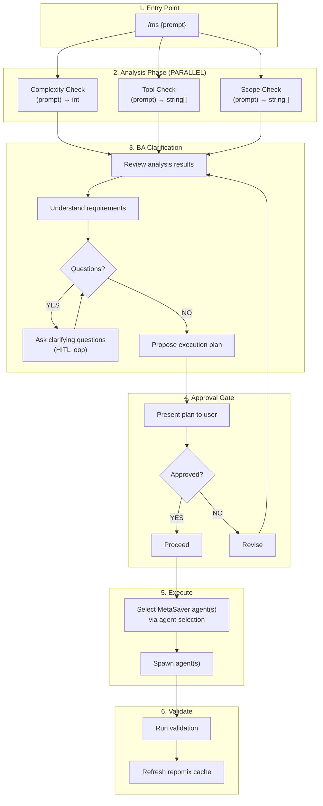

# MS Command Target State

Target workflow architecture for the `/ms` (MetaSaver) command - the intelligent router.

**Purpose:** Semi-freeform task handler with analysis and approval guardrails.

**For structured feature development, use `/build`. For validation, use `/audit`.**

---

## 1. High-Level Flow Overview



---

## 2. Phase Details

### Phase 1: Analysis (PARALLEL)

**See:** `/skill analysis-phase`

Spawn 3 agents in parallel:

- `complexity-check` → score (1-50)
- `tool-check` → required MCP tools
- `scope-check` → targets and references

### Phase 2: BA Clarification

Spawn BA agent to understand requirements:

```
Spawn agent: subagent_type="core-claude-plugin:generic:business-analyst"
```

BA responsibilities:

1. Review analysis results (complexity, tools, scope)
2. Understand what user wants to accomplish
3. Ask clarifying questions if anything is unclear (HITL loop)
4. Propose execution plan:
   - Which MetaSaver agent(s) to use
   - What files will be affected
   - Approach summary (2-3 sentences)

**Output:** Clear understanding + proposed plan presented to user

### Phase 3: Approval Gate

**HARD STOP** - Present plan and wait for user approval.

Show user:

- Complexity score
- Proposed agent(s)
- Files that will be affected
- Brief approach

**Bypass:** Only skip if user prompt contains "do without approval" or "just do it"

### Phase 4: Execute

Use `/skill agent-selection` to identify the correct MetaSaver agent(s).

**CRITICAL:** Use MetaSaver agents ONLY. Never use generic agents.

| Task Type        | Agent                                                       |
| ---------------- | ----------------------------------------------------------- |
| Code changes     | `core-claude-plugin:generic:coder`                          |
| Bug fixes        | `core-claude-plugin:generic:root-cause-analyst` → `coder`   |
| Tests            | `core-claude-plugin:generic:tester`                         |
| Config files     | Appropriate config agent (eslint-agent, vite-agent, etc.)   |
| Agent/skill work | `core-claude-plugin:generic:agent-author` or `skill-author` |
| Questions        | `core-claude-plugin:generic:code-explorer`                  |

Paired TDD structure: tester → impl per story. Compact context between waves. Track progress with TodoWrite throughout execution.

### Phase 5: Validate

If files were modified:

1. Run appropriate validation based on change size
2. Execute `/skill repomix-cache-refresh`

---

## 3. Model Selection

| Complexity | BA     | Workers |
| ---------- | ------ | ------- |
| 1-14       | sonnet | sonnet  |
| 15-29      | sonnet | sonnet  |
| 30+        | opus   | sonnet  |

---

## 4. Examples

```bash
# Simple question
/ms "how does the agent-selection skill work?"
→ Analysis → BA (no questions needed) → Approve → code-explorer answers

# Bug fix
/ms "the complexity-check skill is returning wrong scores"
→ Analysis → BA asks clarifying questions → Approve → root-cause-analyst → coder fixes

# Agent modification
/ms "update the architect agent to include API endpoints"
→ Analysis → BA proposes changes → Approve → agent-author executes

# Quick task with bypass
/ms "fix the typo in build.md, do without approval"
→ Analysis → BA → (approval skipped) → coder fixes
```

---

## 5. Enforcement

1. ALWAYS run Analysis phase first (parallel: complexity, tools, scope)
2. ALWAYS spawn BA to clarify and propose plan
3. ALWAYS stop for approval (unless bypassed with "do without approval" or "just do it")
4. ALWAYS use MetaSaver agents via `/skill agent-selection` - NEVER generic agents
5. ALWAYS validate and refresh cache if files modified
6. Track all tasks with TodoWrite
7. Get user approval before any git operations

---

## 6. Key Differentiator: /ms vs /build vs /audit

| Aspect   | /ms                        | /build            | /audit            |
| -------- | -------------------------- | ----------------- | ----------------- |
| Purpose  | Semi-freeform task handler | Create new code   | Validate existing |
| BA Phase | Always                     | Always            | Always            |
| Approval | Always (unless bypassed)   | Always            | Always            |
| Model    | Varies by complexity       | sonnet (opus 30+) | haiku for workers |

**When to use /ms:**

- General tasks that don't fit /build or /audit
- Mixed tasks
- Unsure which workflow is appropriate

**When to use /build:**

- Know you're creating new features
- Want full PRD workflow with innovation option

**When to use /audit:**

- Compliance checking only
- Config file validation
