# MS Command Target State

Target workflow architecture for the `/ms` (MetaSaver) command - the intelligent router.

**Purpose:** Analyze prompt complexity and route to optimal execution method.

---

## 1. High-Level Flow Overview

```mermaid
flowchart TB
    subgraph Entry["1. Entry Point"]
        A["/ms {prompt}"]
    end

    subgraph Analysis["2-4. Analysis Phase (PARALLEL)"]
        B["Complexity Check<br/>(prompt) → int"]
        C["Tool Check<br/>(prompt) → string[]"]
        D["Scope Check<br/>(prompt) → string[]"]
    end

    subgraph Routing["5. Intelligent Routing"]
        R{"Complexity Score?"}
        R1["Score ≤4<br/>🟢 Simple"]
        R2["Score 5-14<br/>🟡 Medium-Simple"]
        R3["Score 15-29<br/>🟠 Medium-Complex"]
        R4["Score ≥30<br/>🔴 Ultra-Complex"]
    end

    subgraph Simple["🟢 Simple (Score ≤4)"]
        S0["agent-check<br/>(keyword → agent)"]
        S1{"Match found?"}
        S2["Spawn matched agent<br/>(haiku)"]
        S3["Direct Claude<br/>(haiku)"]
        S0 --> S1
        S1 -->|"YES"| S2
        S1 -->|"NO"| S3
    end

    subgraph MedSimple["🟡 Quick Workflow (Score 5-14)"]
        MS1["Architect<br/>(designs WHAT)"]
        MS2["PM picks agents"]
        MS3["Spawn agents"]
        MS4["Validation"]
        MS1 --> MS2 --> MS3 --> MS4
    end

    subgraph MedComplex["🟠 Full Workflow (Score 15-29)"]
        MC1["Requirements Phase<br/>(BA + Vibe Check)"]
        MC2["PRD Approval<br/>(Human Validation)"]
        MC3["Architect<br/>(designs WHAT to build)"]
        MC4["PM picks agents<br/>(assigns tasks to agents)"]
        MC5["Execution Phase<br/>(spawn agents from PM list)"]
        MC6["Report Phase"]
        MC1 --> MC2 --> MC3 --> MC4 --> MC5 --> MC6
    end

    subgraph UltraComplex["🔴 Enterprise + Innovate (Score ≥30)"]
        UC1["Requirements Phase<br/>(BA + Vibe Check)"]
        UC2["Innovate Phase<br/>(Industry Best Practices)"]
        UC3["PRD Approval<br/>(Human Validation)"]
        UC4["Architect (opus)<br/>(designs WHAT to build)"]
        UC5["PM picks agents<br/>(assigns tasks, multi-wave Gantt)"]
        UC6["Execution Phase<br/>(spawn agents from PM list)"]
        UC7["Validation + Report"]
        UC1 --> UC2 --> UC3 --> UC4 --> UC5 --> UC6 --> UC7
    end

    A --> B & C & D
    B & C & D --> R
    R -->|"≤4"| R1
    R -->|"5-14"| R2
    R -->|"15-29"| R3
    R -->|"≥30"| R4
    R1 --> Simple
    R2 --> MedSimple
    R3 --> MedComplex
    R4 --> UltraComplex
```

---

## 2. Routing Decision Matrix

---

## 3. Complexity Score Examples

| Prompt                     | Score | Route          | Agent Match?          | Result                     |
| -------------------------- | ----- | -------------- | --------------------- | -------------------------- |
| "security scan"            | 3     | agent-check    | ✅ security-engineer  | Spawn security-engineer    |
| "audit eslint config"      | 2     | agent-check    | ✅ eslint-agent       | Spawn eslint-agent         |
| "fix error in service.ts"  | 3     | agent-check    | ✅ root-cause-analyst | Spawn root-cause-analyst   |
| "what does this code do?"  | 2     | agent-check    | ❌ no match           | Direct Claude              |
| "explain this function"    | 3     | agent-check    | ❌ no match           | Direct Claude              |
| "add logging to service"   | 8     | Quick Workflow | PM picks agents       | Architect → PM → Spawn     |
| "build JWT auth API"       | 18    | Full Workflow  | PM picks agents       | Req → Arch → PM → Spawn    |
| "migrate to microservices" | 35    | Enterprise     | PM picks agents       | Req → Innovate → Arch → PM |

---

## 4. Full Workflow (Score 15-29)

When /ms routes to Full Workflow, it follows the /build pattern:

```mermaid
sequenceDiagram
    participant U as User
    participant MS as /ms
    participant BA as Business Analyst
    participant VC as Vibe Check
    participant IA as Innovation Advisor
    participant AR as Architect
    participant PM as Project Manager
    participant W as Workers

    U->>MS: /ms {prompt}
    MS->>MS: Analyze (complexity: 18)
    MS->>MS: Route: Full Workflow

    rect rgb(250, 240, 230)
        Note over BA,VC: Requirements Phase
        MS->>BA: Create PRD
        BA-->>VC: PRD
        VC-->>MS: ✅ Validated
    end

    rect rgb(255, 250, 230)
        Note over U,IA: Innovate Phase (Optional)
        MS->>U: Want to innovate?
        U->>MS: Yes
        MS->>IA: Suggest improvements
        IA-->>U: Numbered list
        U->>MS: 1:yes, 2:no, 3:yes
        MS->>BA: Update PRD
        BA-->>VC: Enhanced PRD
        VC-->>MS: ✅ Validated
    end

    rect rgb(230, 255, 230)
        Note over U: Human Validation
        MS->>U: Approve final PRD?
        U->>MS: ✅ Approved
    end

    rect rgb(240, 250, 230)
        Note over AR,PM: Design Phase
        MS->>AR: Design
        AR-->>PM: arch_docs
        PM-->>MS: execution_plan
    end

    rect rgb(250, 230, 240)
        Note over W: Execution Phase
        MS->>W: Execute
        W-->>MS: Results
    end

    MS-->>U: Final Report
```

---

## 5. Quick Reference

| Score | Route          | Model       | Phases                                      | Innovate | PRD Approval |
| ----- | -------------- | ----------- | ------------------------------------------- | -------- | ------------ |
| 1-4   | agent-check    | haiku       | agent-check → Agent OR Direct Claude        | ❌       | ❌           |
| 5-14  | Quick Workflow | sonnet      | Architect → PM picks agents → Spawn         | ❌       | ❌           |
| 15-29 | Full Workflow  | sonnet      | Req → Approval → Arch → PM picks → Exec     | ❌       | ✅           |
| 30+   | Enterprise     | opus/sonnet | Req → Innovate → Approval → Arch → PM picks | ✅       | ✅           |

**Key insight:** Only complexity ≥30 gets the Innovate phase. This reserves industry best practice enhancement for truly complex features where the overhead is justified.

---

## 6. Thinking Levels by Complexity

| Score Range | Thinking Level | Use Case                       |
| ----------- | -------------- | ------------------------------ |
| 1-10        | (none)         | Simple operations              |
| 11-20       | think          | Standard implementations       |
| 21-30       | think-harder   | Refactoring, design            |
| 31+         | ultrathink     | Architecture, complex analysis |

---

## 7. Key Differentiator: /ms vs /build vs /audit

| Aspect       | /ms                   | /build            | /audit            |
| ------------ | --------------------- | ----------------- | ----------------- |
| Purpose      | Route optimally       | Create new code   | Validate existing |
| Routing      | Dynamic by complexity | Always Full+      | Always Full       |
| Innovate     | Only if score ≥30     | ✅ Yes (optional) | ❌ No             |
| PRD Approval | If score ≥15          | ✅ Yes            | If score ≥15      |
| Model        | Varies by score       | sonnet (opus 30+) | haiku for workers |

**When to use /ms:**

- Unsure which workflow is appropriate
- Mixed tasks (some audit, some build)
- Want automatic optimization
- Screenshot analysis that may need implementation

**When to use /build:**

- Know you're creating new features
- Want guaranteed full workflow with innovation option

**When to use /audit:**

- Compliance checking only
- Config file validation
- No innovation needed
