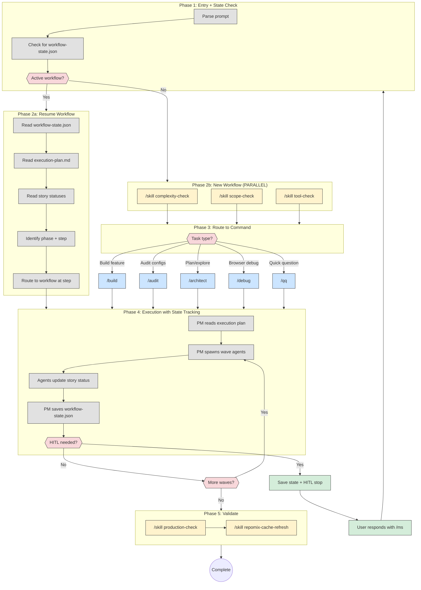
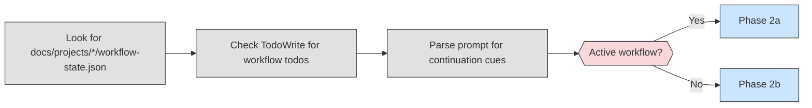
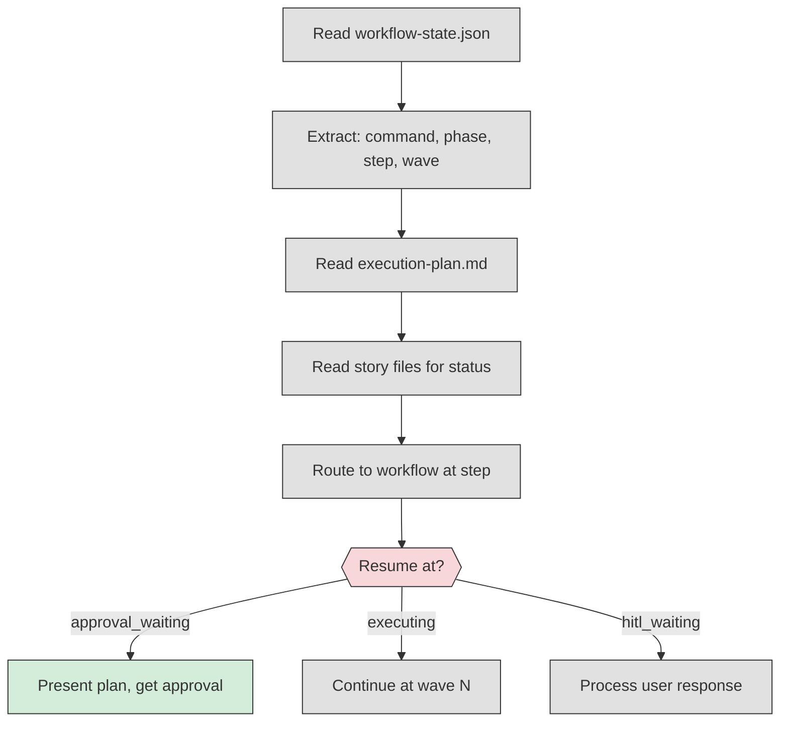
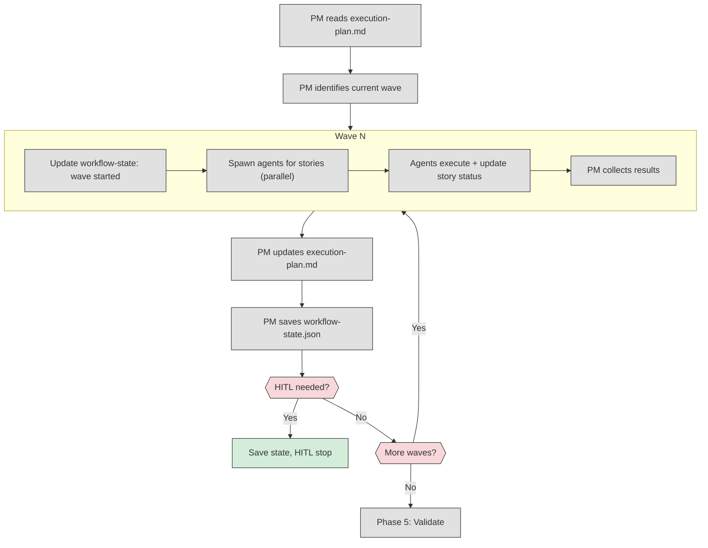

# MS Command Target State

Target workflow architecture for the `/ms` (MetaSaver) command - the universal entry point.

**Purpose:** Universal entry point for all MetaSaver workflows. Routes to appropriate command, tracks workflow state, enables continuation after HITL stops.

**Use /ms for everything.** It handles:

- New work → Routes to /build, /audit, /architect, /debug, /qq
- Continuation → Resumes interrupted workflows at correct step
- State tracking → PM updates workflow-state.json throughout execution

---

## 1. High-Level Flow Overview



---

## 2. Phase Details

### Phase 1: Entry + State Check



**State detection priority:**

1. `workflow-state.json` in most recent project folder
2. TodoWrite items with workflow phase markers
3. User prompt contains: "continue", "proceed", "yes", "do it"

---

### Phase 2a: Resume Workflow



---

### Phase 2b: New Workflow Analysis (PARALLEL)

**See:** `/skill complexity-check`, `/skill scope-check`, `/skill tool-check`

Spawn 3 skills in parallel:

- `complexity-check` → score (1-50)
- `scope-check` → targets and references
- `tool-check` → required MCP tools

---

### Phase 3: Route to Command

| Condition                                              | Route To   |
| ------------------------------------------------------ | ---------- |
| complexity < 15 AND question only                      | /qq        |
| "audit", "validate", "check" + config files            | /audit     |
| "debug", "browser", "UI test"                          | /debug     |
| vague requirements, "plan", "explore", "design"        | /architect |
| clear requirements, "build", "implement", "add", "fix" | /build     |

---

### Phase 4: Execution with State Tracking

**PM manages execution and state:**



**PM responsibilities during execution:**

| When            | PM Action                                                     |
| --------------- | ------------------------------------------------------------- |
| Wave start      | Update workflow-state: `currentWave`, stories to `inProgress` |
| Agent completes | Update story file status, move to `completed`                 |
| Wave complete   | Update execution-plan.md with results                         |
| HITL needed     | Set `status: hitl_waiting`, save `hitlQuestion`               |
| Error occurs    | Set `status: error`, save error details                       |
| All waves done  | Trigger Phase 5: Validate                                     |

---

### Phase 5: Validate

If files were modified:

1. `/skill production-check` - build, lint, test
2. `/skill repomix-cache-refresh` - update cache
3. Clear workflow-state.json (workflow complete)

---

## 3. Workflow State File

Location: `docs/projects/{name}/workflow-state.json`

```json
{
  "command": "build",
  "phase": 5,
  "phaseName": "Execution",
  "step": "wave-execution",
  "currentWave": 2,
  "totalWaves": 3,
  "status": "hitl_waiting",
  "lastUpdate": "2025-12-19T10:30:00Z",
  "epics": [
    {
      "id": "EPIC-001",
      "status": "in_progress",
      "storiesCompleted": 2,
      "storiesTotal": 3
    }
  ],
  "stories": {
    "completed": ["US-001", "US-002"],
    "inProgress": [],
    "pending": ["US-003", "US-004", "US-005"]
  },
  "hitlQuestion": "Wave 2 complete. Proceed with wave 3?",
  "resumeAction": "spawn-wave-3"
}
```

**Status values:**

| Status             | Meaning                            |
| ------------------ | ---------------------------------- |
| `analysis`         | Running analysis phase             |
| `requirements`     | BA creating PRD/epics/stories      |
| `design`           | Architect enriching stories        |
| `approval_waiting` | Waiting for user approval          |
| `executing`        | Running execution waves            |
| `hitl_waiting`     | Stopped for user input             |
| `validating`       | Running production checks          |
| `complete`         | Workflow finished                  |
| `error`            | Error occurred, needs intervention |

---

## 4. Model Selection

| Complexity | BA     | Workers |
| ---------- | ------ | ------- |
| 1-14       | sonnet | sonnet  |
| 15-29      | sonnet | sonnet  |
| 30+        | opus   | sonnet  |

---

## 5. Examples

```bash
# New build task
/ms "add user authentication to the app"
→ Phase 1: No active workflow
→ Phase 2b: Analysis (complexity=28)
→ Phase 3: Route to /build
→ /build executes with state tracking

# Continue after HITL stop
/ms "yes, proceed with the next wave"
→ Phase 1: Found workflow-state.json (build, wave 2, hitl_waiting)
→ Phase 2a: Resume at wave 3
→ Phase 4: PM spawns wave 3 agents

# Answer clarifying question mid-workflow
/ms "use JWT tokens, not sessions"
→ Phase 1: Found workflow-state.json (build, requirements, hitl_waiting)
→ Phase 2a: Resume requirements phase
→ BA incorporates answer, continues

# Quick question (no workflow state)
/ms "how does the auth middleware work?"
→ Phase 1: No active workflow
→ Phase 2b: Analysis (complexity=5)
→ Phase 3: Route to /qq
→ /qq spawns code-explorer, answers

# Audit task
/ms "check if eslint config matches our standards"
→ Phase 1: No active workflow
→ Phase 2b: Analysis (scope=config files)
→ Phase 3: Route to /audit
→ /audit executes with state tracking
```

---

## 6. Enforcement

1. ALL work goes through /ms (except simple questions answered directly)
2. /ms ALWAYS checks for active workflow state first
3. /ms ALWAYS routes to MetaSaver commands (/build, /audit, /architect, /debug, /qq)
4. /ms routes to commands, commands use MetaSaver agents - NEVER spawn generic agents directly
5. PM ALWAYS updates workflow-state.json after each wave
6. PM ALWAYS updates story files with status changes
7. HITL stops ALWAYS save state for resumption
8. User responses via /ms resume at correct workflow step
9. Track all tasks with TodoWrite
10. Get user approval before any git operations

---

## 7. Command Routing Summary

| /ms is...             | Routes to        | Why                           |
| --------------------- | ---------------- | ----------------------------- |
| Universal entry point | All commands     | Single point of enforcement   |
| State-aware           | Resume or new    | Enables workflow continuation |
| Router only           | Commands do work | Separation of concerns        |

**/ms routes. Commands execute. Agents work. PM tracks state.**

---

## 8. Migration from Old /ms

**Old behavior:**

- /ms spawned BA directly
- /ms spawned agents directly
- No state tracking
- HITL broke workflows

**New behavior:**

- /ms checks state first
- /ms routes to commands
- Commands handle their workflows
- PM tracks state throughout
- /ms resumes workflows after HITL
